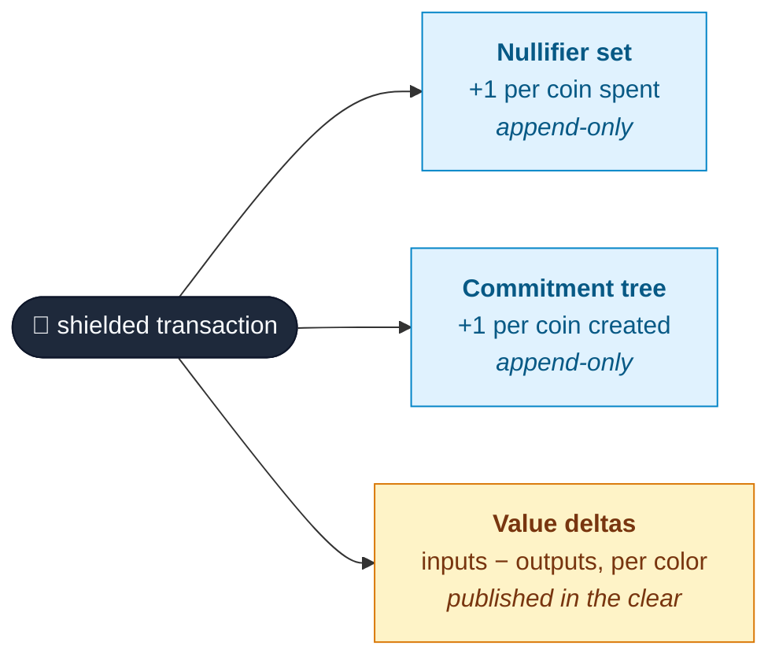
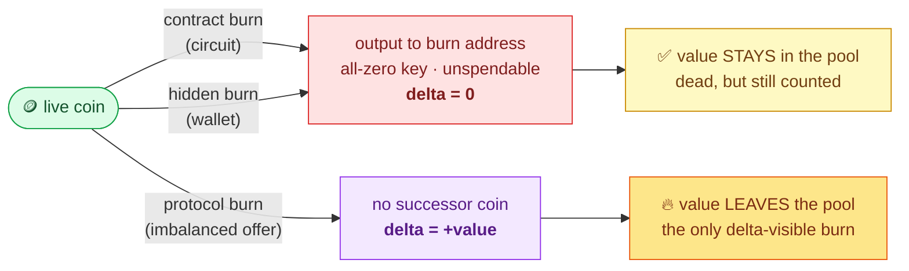
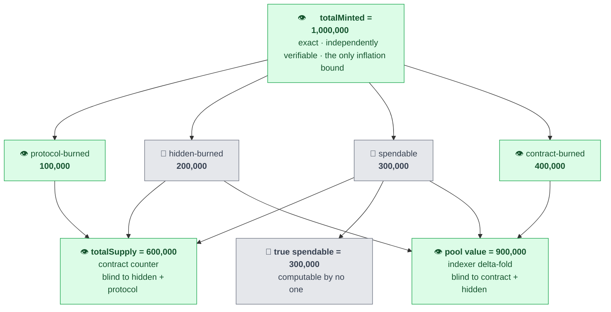

# What "Total Supply" Means for a Native Shielded Token

*Iskander Andrews · OpenZeppelin · Midnight Compact Contracts*

## Abstract

For a native shielded token, "total supply" is not one number but several, each visible to a different observer. This document defines those quantities, proves which are publicly computable and which are not, and confirms each on a decoded on-chain run [3]. Key result: only a *protocol burn* reduces supply visibly; the two burn-address "burns" leave dead-but-counted coins. The asymmetry that matters: hidden inflation is impossible and publicly verifiable, hidden deflation is possible and harmless.

## 1. Introduction

On an account-based ledger, total supply is one storage slot: the contract mediates every mint, burn, and transfer, so one counter is exact. Native shielded tokens on Midnight [1] break that assumption. Coins are protocol-level UTXOs; once minted, they move wallet-to-wallet without the issuing contract ever seeing them. "Total supply" stops being one number and splits into several, each visible to a different observer.

This document defines those quantities (§2), describes the ledger structures and the pool they imply (§3–§4), distinguishes the three ways a coin can be destroyed (§5), enumerates the five resulting supply quantities and proves the relations among them (§6), and draws out the trust model and practical guidance (§7–§9). It accompanies the Native Shielded Token Standard draft [2] and the indexing study [3] that decoded the raw transactions behind these claims.

## 2. Definitions

We pin down every "supply"-flavored term used in this document. The same words mean different things in different ecosystems; here they mean exactly the following.

**Definition 1 (Color / token type).** A 32-byte identifier `tokenType(domain, contractAddress)`; only that contract can mint coins of it. [4, 2]

**Definition 2 (Live coin).** A coin whose commitment is present in the tree and whose nullifier is absent from the set. [5]

**Definition 3 (Value delta / imbalance).** The per-color `inputs − outputs` of a transaction's Zswap offer, published in the clear (`Transaction.imbalances()` in the ledger API). [6, 1]

**Definition 4 (Pool value).** The total value in live coins of a color. It equals the negated delta fold over chain history. [3]

**Definition 5 (`totalMinted`).** A contract counter of all issuance. Exact, and independently verifiable against `shieldedMints` effects. [2]

**Definition 6 (`totalBurned`).** A contract counter of contract-mediated burns only. A lower bound on total destruction. [2]

**Definition 7 (`totalSupply`).** `totalMinted − totalBurned`. An upper bound on spendable supply, not an exact figure. [2]

**Definition 8 (Spendable / circulating supply).** The value in live coins whose holders can actually produce a nullifier. Computable by no one. [3]

**Definition 9 (Burn address).** The all-zero `ZswapCoinPublicKey` returned by `shieldedBurnAddress()`. A keyless recipient, not a sink. [4, 2]

**Definition 10 (Contract burn).** `_burn` / `_burnFromContract`: a balanced send to the burn address, counted in `totalBurned` and disclosed in the transcript. [2]

**Definition 11 (Hidden burn).** A wallet's own balanced send to the burn address. Delta zero, amount sealed, invisible to contract and indexer. [3]

**Definition 12 (Protocol burn).** An imbalanced offer: input value with no successor coin. Positive delta, amount public, no contract record. [3]

**Definition 13 (Supply auditability / inflation bound).** Public verifiability that at most X of an asset exists. Zswap provides it by publishing per-color deltas. [6, 7]

## 3. The three ledger structures

Every shielded transaction touches three public structures:

- **Commitment tree**: append-only. One entry per coin ever created. Nothing is ever deleted.
- **Nullifier set**: append-only. One entry per coin ever spent.
- **Value deltas**: each transaction's Zswap offer publicly declares, per token color, input value minus output value.



*Figure 1. The three public, append-only structures every shielded transaction writes to. The value deltas are the only place value creation or destruction becomes visible.*

A coin is **live** (Definition 2) when its commitment is present and its nullifier is not. Spending never removes a commitment. "Removing a coin from the tree" is not an operation the ledger has; the nullifier set is the deletion mechanism, and it is unlinkable to the commitment it kills.

## 4. The pool

The **pool value** of a color (Definition 4) is the total value sitting in its live coins. It is not stored anywhere on chain. It is implied by history, as Equation (1):

```math
\texttt{poolValue}(color) = -\sum_{tx} \Delta_{tx}(color) \tag{1}
```

- A balanced transaction (ordinary transfer) has delta zero and leaves the pool untouched.
- A mint has negative delta, justified by the contract's `shieldedMints` effect. Value enters the pool.
- A transaction with positive delta destroys the surplus: input value with no successor coin. Value leaves the pool. This is a **protocol burn** (Definition 12).

"Value leaves the pool" means exactly that and nothing else: a positive delta. Any indexer can fold the chain and recompute pool value exactly.

## 5. Three ways to destroy a coin

Three mechanisms remove a coin from circulation. Table 1 contrasts what each does to the ledger.

*Table 1. The three destruction paths and what each observer records.*

| Path | Nullifier | New commitment | Delta | Pool value | Contract sees it |
|---|---|---|---|---|---|
| Contract burn (`_burn`) | input coin | burn address | 0 | unchanged | yes: counter + disclosed amount |
| Hidden burn (wallet → burn address) | input coin | burn address | 0 | unchanged | no |
| Protocol burn (imbalanced offer) | input coin | none | positive | decreases | no |



*Figure 2. Where the value goes. Both burn-address sends (contract and hidden) leave the coin in the pool with delta zero; only the protocol burn produces a positive delta and removes value.*

The non-obvious row in Table 1 is the first one. A contract burn is, at the protocol level, an ordinary balanced send whose recipient happens to be keyless: the all-zero public key, for which no secret key can be derived. The coin it creates is live forever and spendable never. The pool does not shrink. What distinguishes a contract burn from a hidden burn is only that the contract increments `totalBurned` and discloses the amount in the call transcript. The burn address is a recipient, not a sink.

### 5.1. Each path, in code

The three rows of Table 1 are three different transaction shapes. The snippets below are condensed from the indexing study [3] (`ShieldedERC20.compact`, `src/hidden-burn.ts`, `src/verify-supply.ts`); error handling and type casts are elided for readability.

A **contract burn** is a circuit. It takes the coin in, edits a counter, and sends to the keyless address. At the protocol level it is an ordinary balanced send, so the delta is zero.

```ts
// ShieldedERC20.compact — the burn circuit (change handling elided)
export circuit burn(coin: ShieldedCoinInfo, amount: Uint<128>): ShieldedSendResult {
  assert(coin.color == _color, "token not created from this contract");
  assert(coin.value >= amount, "insufficient token amount to burn");

  receiveShielded(disclose(coin));                 // contract takes custody of the coin
  _totalSupply = _totalSupply - disclose(amount);  // edit the local counter

  // send to a live-but-unspendable output. one input, one output → delta = 0.
  return sendImmediateShielded(disclose(coin), shieldedBurnAddress(), disclose(amount));
}

// stdlib: the "burn address" is just a keyless recipient
circuit shieldedBurnAddress(): Either<ZswapCoinPublicKey, ContractAddress> {
  return left(default<ZswapCoinPublicKey>);        // the all-zero coin public key
}
```

A **hidden burn** is the same shape, but built by a wallet with no contract in the loop. Same keyless recipient, same zero delta; the difference is only that no counter moves and no amount is disclosed.

```ts
// src/hidden-burn.ts — a plain wallet transfer, no contract call
const burnAddress = new ShieldedAddress(
  ShieldedCoinPublicKey.fromHexString("00".repeat(32)), // all-zero coin key
  myAddr.encryptionPublicKey,                           // any valid encryption key
);

const recipe = await wallet.transferTransaction(
  [{ type: "shielded",
     outputs: [{ type: colorHex, receiverAddress: burnAddress, amount: BURN_AMOUNT }] }],
  { shieldedSecretKeys, dustSecretKey },
  { ttl: ttlOneHour(), payFees: true },
);
// → balanced offer: one input, one output (to the dead key). delta = 0.
```

A **protocol burn** is a different shape entirely: an input with no successor coin. The wallet builds the offer by hand, and the one subtlety is that it must balance *only* the fee token, or the balancer would add a change output and re-absorb the surplus.

```ts
// src/verify-supply.ts — a hand-built, imbalanced Zswap offer
const [, input] = localState.spend(zswapSecretKeys, coin, 0); // spend the coin → an INPUT
const offer = ZswapOffer.fromInput(input);                    // one input, ZERO outputs
const unproven = Transaction.fromParts(networkId, offer);
// unproven.imbalances(0) now shows delta[color] = +value — the surplus to destroy

const recipe = await wallet.balanceUnprovenTransaction(
  unproven,
  { shieldedSecretKeys: zswapSecretKeys, dustSecretKey },
  { ttl: ttlOneHour(), tokenKindsToBalance: ["dust"] }, // balance fees ONLY — never the coin
);
await wallet.submitTx(await wallet.finalizeRecipe(recipe));
// → imbalanced offer: one input, no output. delta = +value. value leaves the pool.
```

The contract and hidden burns differ only in *who* authors an identical balanced send; the protocol burn is the only one that omits the output, and the only one a contract cannot author (§8).

## 6. The five supply quantities

Table 2 lists the five quantities and their computability.

*Table 2. The five supply quantities and who can compute each.*

| Quantity | Definition | Who can compute it | Status |
|---|---|---|---|
| `totalMinted` | all value ever created | contract; indexer (via `shieldedMints` effects) | exact |
| `totalBurned` | contract-mediated burns | contract; indexer (via disclosed transcripts) | exact for what it counts |
| `totalSupply` | `totalMinted − totalBurned` | contract | upper bound |
| pool value | value in live coins | indexer (delta fold) | exact, includes dead burn-address value |
| spendable supply | pool value minus burn-address value | no one | unknowable |

Figure 3 shows how each observer's counter over-counts by whatever dead value it cannot see. An arrow means *this slice is still included in that number*. Color and icon carry one meaning: **green / 👁️** is publicly computable, **gray / 🙈** is unknowable to every observer (numbers from the walk-through in §6.1).



*Figure 3. How each observer's counter over-counts. `totalMinted` splits into four slices; an arrow from a slice means that slice is still counted by that observer. The contract's `totalSupply` carries hidden and protocol burns it never saw; the indexer's pool value carries contract and hidden burns. Only true spendable supply excludes all dead value, and it is computable by no one.*

The two computable counters subtract *different* burn sets from the same `totalMinted`, which yields the central relations.

**Claim 1 (both counters are upper bounds).** For every color, `spendable ≤ totalSupply` and `spendable ≤ poolValue`. *Justification.* By construction, `totalSupply = totalMinted − contractBurned` and `poolValue = totalMinted − protocolBurned`, while `spendable = totalMinted − contractBurned − hiddenBurned − protocolBurned`. Subtracting gives `totalSupply − spendable = hiddenBurned + protocolBurned ≥ 0` and `poolValue − spendable = contractBurned + hiddenBurned ≥ 0`.

**Claim 2 (neither bound dominates).** The contract counter misses protocol burns; the delta fold misses burn-address sends, including the contract's own. So neither `totalSupply ≤ poolValue` nor `poolValue ≤ totalSupply` holds in general; their difference is `contractBurned − protocolBurned`, of either sign.

**Claim 3 (tightest computable bound).** Combining both public sources gives the tightest bound any observer can compute, as Equation (2):

```math
\texttt{spendable} \;\le\; \texttt{totalSupply} - \texttt{protocolBurns} \tag{2}
```

The residual gap between this bound and true spendable supply equals the hidden-burn value: sealed in Pedersen commitments, delta-neutral, indistinguishable from live coins. No observer can close it.

### 6.1. A verified walk-through

The indexing study [3] deployed a shielded token on a local Midnight stack and decoded the raw transactions for each phase in Table 3 (the protocol-burn row extends the study's published supply-audit matrix using its decoded protocol-burn flow).

*Table 3. Measured supply at each phase of the verified run, in units of the token.*

| Phase | `totalSupply()` | Pool value | Spendable |
|---|---|---|---|
| Mint 1,000,000 | 1,000,000 | 1,000,000 | 1,000,000 |
| Contract burn 400,000 | 600,000 | 1,000,000 | 600,000 |
| Hidden burn 200,000 | 600,000 | 1,000,000 | 400,000 |
| Protocol burn 100,000 | 600,000 | 900,000 | 300,000 |

End state: the contract reports 600,000. The delta fold reports 900,000. The tightest computable bound from Equation (2) is 500,000 (`totalSupply` minus the 100,000 protocol burn). The true spendable supply is 300,000, and the 200,000 gap is the hidden burn, invisible to every observer forever. Note what each column missed: the contract never saw the hidden or protocol burn; the fold never saw the contract or hidden burn. Each is an honest upper bound over a different blind spot, exactly as Claims 1–3 predict.

## 7. Supply auditability is not a trust problem

The trust-critical question for any shielded asset is hidden **inflation**: if holders cannot verify "at most X of this exists", the asset is worthless, because dilution is invisible. This is the lesson of the Zcash counterfeiting vulnerability [7], and it is why Zswap [6] publishes per-color deltas at all: value conservation is publicly auditable by construction.

**Claim 4 (inflation bound).** `totalMinted` is exact and independently verifiable against public `shieldedMints` effects, and only the issuing contract can ever create coins of its colors. Hidden inflation is therefore impossible, and pool value is exact from the delta fold (Equation (1)). Native shielded tokens pass the auditability test twice: once on issuance, once on the pool.

What remains unknowable, the spendable share, errs only in the deflationary direction: real supply can be lower than every bound, never higher. No one needs to be trusted for the inequality `spendable ≤ totalSupply` (Claim 1) to hold. The right description is not "trust-based" but **trust-free and knowledge-limited**, and the limit is the same one cash has: nobody knows how many banknotes have been destroyed in fires.

## 8. Why a contract cannot author a protocol burn

If protocol burns are the only delta-visible destruction, why doesn't `_burn` make one? Because a contract cannot author an offer. Contracts emit ledger *effects*: claimed receives, claimed spends, claimed nullifiers, and mints. The offer that carries the transaction must balance every one of them. `shieldedMints` is the only one-sided value effect in the ledger, and it points in the creation direction only. There is no `shieldedBurns` counterpart.

Nor can a circuit observe the surrounding offer's deltas. That closes the workaround of letting the wallet build the imbalance while the contract "records" it: a record-only burn circuit cannot verify the amount, so callers could inflate `totalBurned` without destroying anything. `totalSupply` would then under-report, breaking the one inequality the standard must keep (Claim 1). Over-reporting is the safe failure direction; under-reporting is the dangerous one.

A burn-address send is therefore the strongest destruction a contract can both express and verify today. If the ledger gains a shielded burn effect (the direction discussed in MPS-0013 [8]), a deployed token can migrate `_burn` to it through a CMA verifier-key rotation with no state migration: the counters keep their semantics and the bound tightens, because contract burns would start appearing in the delta fold.

## 9. Who needs which number

- **Holders and markets** need the inflation bound: `totalMinted` and pool value. Both exact, both verifiable. This is the number that makes the coin trustworthy.
- **Indexers and explorers** should display `totalSupply` as an upper bound and may tighten it by subtracting protocol burns from the delta fold (Equation (2)). Labeling either number "circulating supply" is wrong.
- **Issuers** (a stablecoin desk, an RWA issuer) need outstanding liability: `totalMinted − redemptions`, which is exactly `totalSupply` when redemptions run through contract burns. Hidden-burned and lost coins can never return for redemption, so reserves sized to `totalSupply` are always sufficient. The unknowable error over-collateralizes them.
- **No one** gets spendable supply. No design choice recovers it; it is the price of value-hiding transfers.

## 10. Conclusion

Total supply for a native shielded token is not one number but a small family of them, and naming each precisely is the whole task:

- The commitment tree is history, not supply. Nothing is ever removed from it.
- The pool shrinks only on positive deltas. Burn-address coins die inside it.
- A burn has two independent properties: finality (all three paths have it) and visibility (each path shows to a different observer).
- Two honest upper bounds beat one dishonest exact-looking counter. Name the quantities for what they are.
- Hidden inflation is impossible and verifiable; hidden deflation is possible and harmless. That asymmetry is the whole supply story.

## References

1. [Midnight — Zswap documentation](https://docs.midnight.network/concepts/zswap)
2. [Native Shielded Token Standard (MIP draft)](https://app.notion.com/p/openzeppelin/wip-mip-xxxx-native-shielded-token-standard-37bcbd1278608009947cd63c762bebd6) — see §Terminology, §Supply Accounting, §Burn Circuits
3. [Indexing study: `exploring-native-shielded-token-indexing`](https://github.com/0xisk/exploring-native-shielded-token-indexing) — includes the `hidden-burn` and `verify-supply` flows
4. [Compact standard library](https://docs.midnight.network/compact)
5. [Midnight — UTXO model](https://docs.midnight.network/concepts/utxo)
6. [Zswap: privacy-preserving atomic swaps (IACR ePrint 2022/1002)](https://eprint.iacr.org/2022/1002)
7. [Electric Coin Co. — Zcash counterfeiting vulnerability successfully remediated](https://electriccoin.co/blog/zcash-counterfeiting-vulnerability-successfully-remediated/)
8. [MPS-0013: Zswap business logic](https://github.com/midnightntwrk/midnight-improvement-proposals/blob/main/mps/mps-0013-zswap-business-logic.md)
