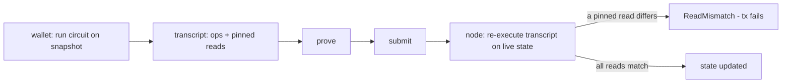

# Concurrency on Midnight

> **Status:** living draft (2026-07-24), destination Notion. Companion to `cross-contract-calls.md`. The Midnight docs site covers this topic only at a high level (and lags the code), so every mechanism claim below is verified against pinned sources: the Compact compiler at [`c06961e`](https://github.com/LFDT-Minokawa/compact/tree/c06961eb661942f7689c6509d0913326f264e848) and midnight-ledger at [`e1edad2`](https://github.com/midnightntwrk/midnight-ledger/tree/e1edad2d7019e1520d173f3e22e9991903225cef).

# 1. Summary

How **contract-state concurrency** works on Midnight, and how to design Compact contracts for it. A Compact transaction ships a **fixed recording** (transcript) of its ledger operations, built against a state snapshot; the chain re-executes the recording against **live** state. Exactly one thing makes two transactions conflict in practice: a **pinned read** — any ledger value that entered the circuit is baked into the transcript and must match at replay (`ReadMismatch` otherwise). Everything else commutes.

The consequences this document develops:

- Mutations the circuit never reads back (tree append, per-key map/set insert, list push, `Counter.increment`) are replayed against live state and **commute**; `x = x + v` on a shared cell serializes all its writers.
- Plain `MerkleTree.checkRoot` pins the *current* root (any concurrent write kills you); `HistoricMerkleTree.checkRoot` pins `root ∈ history` (concurrent inserts are harmless).
- Every read-modify-write accumulator in this library's token designs is a serialization point: the note token's encrypted supply, the account tokens' **recipient balance cells**, the native shielded token's per-color supply counters (§8).
- The general fix is the pattern the protocol itself uses for Zswap: **split "credit" from "absorb"** — writers append commutative deltas to an inbox; a fold absorbs them (§9). Four generic mechanism modules implement it (§13).
- The pattern's limit is **order-dependent state**: an AMM swap's output is a function of the reserves, so swaps genuinely don't commute — the fix there is a batch auction, not an inbox (§8.5).
- Losing a race costs no fees but costs a full re-prove + finality wait — at ~tens of seconds per retry, hot-cell contention is a real throughput ceiling, not a nuisance (§6).

**Audience & scope:** contract authors on Midnight (this library's maintainers first). Contract state only — Zswap coin transfers between users have their own protocol-level concurrency story (§7).

# 2. How a transaction executes

A contract call is *not* "send the arguments, the chain runs the circuit". The wallet runs the circuit locally against a snapshot of the contract state and records every ledger operation as a small VM program — the **public transcript** [[1]](#c-ref-1)[[13]](#c-ref-13). The transaction is that program plus a ZK proof that it was produced by an honest circuit run. The chain never re-runs the circuit; it re-executes the program.



Between "prove" and "re-execute", *other* transactions may land and change the contract state. Concurrency on Midnight is entirely about which recordings survive that.

# 3. The conflict model, stated precisely

Exactly two things tie a transcript to the snapshot it was built on:

- **Pinned reads.** Every ledger read the circuit consumed is emitted as a `popeq` op, and the proving runtime bakes the value that was read into the transcript [[12]](#c-ref-12). At application, the VM pops the live value and compares: `if expected != actual → Err(ReadMismatch)` [[14]](#c-ref-14).
- **Declared effects.** The transcript carries an `Effects` object up front ("Effects declares up front what a contract *will* do, and then the longer check that this is correct is deferred" [[16]](#c-ref-16)); after re-execution the ledger requires recomputed == declared [[15]](#c-ref-15). Effects cover Zswap-level side effects (claimed coins, mints, contract calls); they are per-transaction and are not a cross-transaction conflict source for ordinary state.

Nothing else binds the recording to its snapshot — the proof binds the program, not the contract-state root. Ops that stay inside the VM program are re-executed against live state and succeed under any interleaving. The official guidance states the distinction for counters: "the `increment` will (almost) always succeed, while the read-add-write sequence is prone to failure" [[2]](#c-ref-2).

Two corollaries worth internalizing:

- **Conflicts are read-vs-write.** A pinned read breaks only when another transaction *writes* that cell or key. Concurrent reads never collide; concurrent blind writes to different keys never collide.
- **"Did the value cross into my Compact code?" is the whole test.** Assert on it, branch on it, add to it, hash it — pinned. Only mutate it — not pinned.

# 4. What each ledger operation pins

Mechanical, from the compiler's ADT→op table [[4]](#c-ref-4):

| Compact operation | Pins? | Op-level reason |
| --- | --- | --- |
| Cell read (ledger value used in-circuit) | **yes** — the value | ends in `popeq` [[5]](#c-ref-5) |
| Cell write `x = ...` | no | blind `ins` overwrite; old value untouched [[5]](#c-ref-5) |
| `Counter.increment(n)` | no | relative `addi` on the live cell [[6]](#c-ref-6) |
| `Counter.read()` | **yes** | `popeq` [[6]](#c-ref-6) |
| `Set.member` / `Map.lookup` | **yes** — the result | `member`/`idx` + `popeq` [[7]](#c-ref-7)[[8]](#c-ref-8) |
| `Set.insert` / `Set.remove` / `Map.insert` | no | per-key blind write [[7]](#c-ref-7) |
| `List.pushFront` | no | length bump is a relative `addi`; node splice is structural [[9]](#c-ref-9) |
| `MerkleTree.insert` / `insertHash` | no | reads `first_free` onto the VM stack only (never into the circuit), inserts there, bumps with relative `addi` — two concurrent inserts land at successive indices [[10]](#c-ref-10) |
| `MerkleTree.insertIndex*` | index literal only | the explicit index is a program literal; `first_free := max(...)` is stack-side [[10]](#c-ref-10) |
| `MerkleTree.checkRoot(r)` | **yes** — `currentRoot == r` | `root`, `eq`, `popeq`: any concurrent tree write flips it [[10]](#c-ref-10) |
| `HistoricMerkleTree.insert` | no | as `MerkleTree.insert`, plus appends the new root to the history map [[11]](#c-ref-11) |
| `HistoricMerkleTree.checkRoot(r)` | **yes** — `r ∈ history` | `member` over the history map + `popeq`; inserts only ever *add* roots, so the pinned `true` survives concurrent inserts [[11]](#c-ref-11) |
| `HistoricMerkleTree.resetHistory()` | no (but see §9.4) | clears the history map, re-adds the current root — flips *other* transactions' pinned `r ∈ history` [[11]](#c-ref-11) |

The state shapes behind this: on-chain contract state is just `Null | Cell | Map | Array | BoundedMerkleTree` [[19]](#c-ref-19). `Counter` is a cell, `Set` is a map-to-null, `List` is `[head, tail, length]`, `MerkleTree` is `[tree, firstFreeCell]`, `HistoricMerkleTree` is `[tree, firstFreeCell, historyMap]` [[4]](#c-ref-4)[[11]](#c-ref-11).

# 5. Worked examples

## 5.1 `x = x + 1` vs `Counter.increment(1)`

Compact-level `+` forces the old value through the circuit:

```text
x = x + 1                    Counter.increment(1)
─────────────────            ─────────────────────
read x, MUST equal 5   ←pin  navigate to counter
write x := 6                 addi 1               ←no value recorded
```

Two transactions built at `x = 5`: with the left form, the first lands (5→6) and the second is rejected (`live 6 ≠ baked 5`). With the right form both land (5→6→7). Same increment, different compilation, opposite concurrency. The pin on the left is also what keeps it *correct* — without it the second replay would blindly write `6` and lose an increment.

## 5.2 Two concurrent tree appends

`_commitments.insert(cm)` records: *read `first_free` onto the VM stack, insert the leaf hash there, `addi 1`*. The leaf hash is a program literal (it came from the proof); the **index is computed at replay time**. Transfer A built at index 41 lands at 41; transfer B, also built at 41, replays after A and lands at 42. No collision — the commitment tree behaves like an append-only log.

## 5.3 Plain vs historic `checkRoot`

A spend proves Merkle membership against root `R` and asserts `checkRoot(R)` — the boolean entered the circuit, so it is pinned `true`.

- **Plain tree**: `checkRoot` = `currentRoot == R`. Any concurrent insert changes the current root → live answer `false` ≠ pinned `true` → rejected. A plain tree at a hot chokepoint couples *every* prover's liveness to *every* writer.
- **Historic tree**: `checkRoot` = `R ∈ historyMap`, and inserts only add entries. The pinned `true` survives any number of concurrent inserts. Only `resetHistory` (an explicit, rare operation) breaks it.

This is the entire reason the note token's commitment tree is a `HistoricMerkleTree` and the reason a plain tree is the *right* choice only when you **want** writes to invalidate in-flight proofs (revocation semantics).

## 5.4 Designed conflicts: same-key races

`Set.member(nf)` pins the answer for that key only. Two spends of the *same* note both pin `nf ∉ _nullifiers` and both insert it: first lands, second gets `ReadMismatch`. That is the double-spend protection working — the conflict model is also the safety model. Same shape: freeze-vs-spend races on one nullifier, one-shot `initialize` races, role-rotation invalidating the old key's in-flight transactions. Do not "fix" these.

# 6. Failure semantics: what losing a race costs

Transaction application: guaranteed section first (fees are taken as part of it), then fallible segments. A **guaranteed-section failure rejects the whole transaction with no fees taken**; a **fallible-segment failure rolls back only that segment, fees stand** [[15]](#c-ref-15)[[17]](#c-ref-17). Compact code runs in the guaranteed section unless split with `Kernel.checkpoint` [[20]](#c-ref-20).

So a losing racer pays nothing on-chain — but pays wallet-side: rebuild the transcript against fresh state, **re-prove, resubmit, wait finality again**. On today's stack that is tens of seconds per retry. Under sustained contention a conflicting class degrades to ~one landed transaction per retry cycle, which is why hot-cell design matters for any high-throughput deployment: the failure mode is not lost money, it is a throughput ceiling and terrible UX.

# 7. Prior art in the protocol: how Zswap avoids this

Zswap — Midnight's native shielded token layer — is the existence proof for the patterns in §9. Shielded transfers between users never conflict in contract state because the protocol itself:

- appends commitments at a ledger-level `first_free` counter it owns and orders (`try_update_hash(first_free, ...); first_free += 1`) [[18]](#c-ref-18),
- keeps a **windowed root history** so proofs against slightly-stale roots stay valid, pruned by time, not count: `past_roots.filter(tblock − 1h)` [[18]](#c-ref-18),
- merges independently-built offers at the transaction level instead of making them race.

In other words: append-only inbox + tolerant membership + windowed history. A contract-level pool has to rebuild these patterns by hand — which is exactly what §9 proposes.

# 8. Case studies: where our designs conflict today

Covers the three token families in/around this repo — the confidential note token (PR [#679](https://github.com/OpenZeppelin/compact-contracts/pull/679)), the account-model fungible tokens, the native shielded token — plus the AMM boundary case.

## 8.1 Confidential note token (PR #679)

Full matrix in `confidential-note-token.md` §14. Summary:

- **Transfers commute** — commitment-tree appends, per-key nullifier inserts, list pushes, historic root check: nothing hot is pinned. The note model is the concurrency-friendly shape.
- **Mints/burns mutually conflict** — the homomorphic supply add runs in-circuit (the VM has no EC ops), so `_encSupply`'s old ciphertext is pinned; every mint/burn is a read-modify-write of one cell.
- **`_seizureCount` / `_attestationCount`** are in-circuit `+ 1` → seizes and attestations self-serialize.
- **Allowlist (plain tree)** — every admin add/remove aborts all in-flight KYC-proven spends.

## 8.2 Account-model tokens: `FungibleToken` and `ConfidentialFungibleToken`

The public `FungibleToken` updates balances as read-modify-write:

```compact
_balances.insert(canonTo, toBal + value)   // toBal came from lookup → pinned
_totalSupply = _totalSupply + value        // pinned
```

([`FungibleToken.compact:532-546`](https://github.com/OpenZeppelin/compact-contracts/blob/02fabb61/contracts/src/token/FungibleToken.compact#L532-L546) [[22]](#c-ref-22).)

Consequences:

- **Sender-side serialization** (two transfers from one account conflict) is inherent and fine — it is account-nonce semantics; you cannot spend a balance twice without ordering.
- **Recipient-side serialization is the killer**: crediting pins the *recipient's* cell, so **all inbound payments to one account conflict with each other**. A merchant, exchange deposit address, or treasury receiving N payments per block gets 1 and rejects N−1. Unlike sender ordering, nothing about the asset semantics requires this.
- Every mint/burn serializes on `_totalSupply`.

`ConfidentialFungibleToken` (PR #602 lineage) shares the account-cell shape with encrypted balances — the homomorphic credit must read the old ciphertext in-circuit, so the recipient hotspot is structurally identical, and unlike the public token the read cannot even be moved into the VM program (no EC ops there). The account model without an inbox is the *worst* concurrency shape of the three families.

## 8.3 Native shielded token

- **User↔user transfers never touch the contract** — Zswap moves the coins, offers merge at protocol level (§7). No contract conflict at all. This is the family's structural advantage.
- **Supply accounting conflicts**: `_totalMinted.insert(domain, current + amount)` is a pinned per-color read-modify-write ([`NativeShieldedTokenSupplyCore.compact:83`](https://github.com/OpenZeppelin/compact-contracts/blob/02fabb61/contracts/src/token/extensions/NativeShieldedTokenSupplyCore.compact#L83) [[23]](#c-ref-23)) — concurrent mints of one color serialize.
- **Contract-owned coin cells** (treasury/escrow composers): a contract that keeps its holdings as one `QualifiedShieldedCoinInfo` cell and does receive→merge on deposit pins that cell in every deposit — all deposits serialize, same class as `_encSupply`.

## 8.4 The cross-family pattern

Same defect everywhere, different clothing: **a single accumulator cell whose update must read the old value in-circuit**. Note-token supply ciphertext, account balance cells, per-color supply counters, treasury coin cells. That is the thing to design away.

## 8.5 Beyond tokens: the AMM case (Lunarswap)

Lunarswap (Uniswap-v2 shape on Midnight) is the case the delta inbox does NOT fix, and it shows the model's semantic limit. Its factory keeps [`pool: Map<PairId, Pair>`](https://github.com/OpenZeppelin/midnight-apps/blob/fd7bfdcda810a19e5b121d21dd2aaf6a7369a7f7/contracts/src/lunarswap/LunarswapFactory.compact#L52) and [`reserves: Map<ReserveId, QualifiedShieldedCoinInfo>`](https://github.com/OpenZeppelin/midnight-apps/blob/fd7bfdcda810a19e5b121d21dd2aaf6a7369a7f7/contracts/src/lunarswap/LunarswapFactory.compact#L63) [[25]](#c-ref-25) — each reserve is a contract-owned Zswap coin. A swap conflicts twice over:

- **Price pin (semantic):** the constant-product output is a function of the reserves, so the circuit must read them — any concurrent swap on the pair flips the baked values.
- **Coin pin (mechanical):** spending/merging a contract coin pins its exact `QualifiedShieldedCoinInfo` (value, nonce, mt_index), and every swap replaces both reserve coins — the §8.3 treasury hotspot, per pair.

Two users swapping the same pair in one block: first lands, second gets `ReadMismatch`. Liquidity add/remove and the per-swap `kLast`/cumulative stats conflict the same way.

**Why no inbox variant fixes it:** supply deltas commute because they are order-independent (+50 is +50 at any total). A swap's effect *depends on current state* — order sets the price — so two swaps genuinely do not commute, semantically. Any fix must decide who gets which price, not just re-plumb state. There is also a UX bind: an atomic swap must know its exact output *now*, which requires pinning the price; atomic-swap UX and concurrency are directly at odds on this VM. (Perspective: Uniswap on Ethereum also serializes swaps, but the EVM *re-executes* the call at landing time, so a raced swap silently gets a worse price bounded by `minOut`. Kachina replays a fixed transcript, so a raced swap *fails* — the pin is enforced slippage protection with a harsher failure mode, not a Midnight defect.)

**The fix is a batch swap (frequent batch auction)** — §9.2's credit/absorb architecture with an AMM payload, as shipped by Penumbra [[26]](#c-ref-26) and, economically, CoW Protocol [[27]](#c-ref-27), rooted in Budish et al.'s batch-auction design [[28]](#c-ref-28):

1. **Submit (commutes):** escrow the input coin in its OWN slot (per-intent map entry keyed by user randomness — never merged into the reserve coin) and append a swap intent (direction, amount, `minOut`, payout key) to an inbox. Any number of users per pair per block.
2. **Settle (serialized, once per pair per batch):** a crank — safely permissionless, like `foldSupply` — drains the intents, **nets buys against sells** (netted volume crosses at the midpoint with zero price impact; only the imbalance walks the curve), merges the escrows, updates the reserves ONCE, and computes one uniform clearing price.
3. **Payout (commutes or single-tx):** the settle transaction sends output coins to every intent's payout key, or settlement commits output NOTES and users claim through the note machinery.

Beyond unblocking concurrency, the batch upgrades the product: a uniform clearing price makes sandwich attacks structurally impossible (no "before/after" inside a batch), and intents can stay sealed until settlement — MEV resistance that fits a privacy chain. Costs: two-phase UX, a crank, a block or two of latency, and a settlement circuit whose size bounds the per-batch intent count.

Module implications: the inbox *architecture* reuses (per-intent map, witness-driven drain, completeness assert), but the payload and settlement math are AMM-specific — a future `BatchSwap` module family, not a delta-inbox variant. Sharding the pool is rejected outright (it fragments liquidity and splits the price).

# 9. Design patterns: the fixes, ranked by generality

## 9.1 `Counter` for every counter not read in-circuit

`_seizureCount`, `_attestationCount`, plain analytics counters: swap `Uint` cells for `Counter`. `increment` is a relative op and commutes [[6]](#c-ref-6); the value stays readable off-chain and via `Counter.read` where a circuit genuinely needs it (accepting the pin there). Zero design cost; do it everywhere by default.

## 9.2 Pending-delta inbox + fold — the general accumulator fix

Split *credit* (hot, must commute) from *absorb* (cold, may serialize):

```compact
// Writers: commutative — a blind per-key insert. `id` is derived from the
// writer's fresh randomness witness, NOT from any ledger read.
export ledger _pending: Map<Bytes<32>, Delta>;
circuit _credit(id: Bytes<32>, delta: Delta): [] {
  _pending.insert(disclose(id), disclose(delta));
}

// Folder: serialized with itself only. The witness supplies which keys to
// absorb (an indexer knows the map's contents); the circuit pins exactly
// those K entries + the accumulator — never the keys concurrent writers add.
circuit _fold(): [] {
  const ids = wit_PendingIds();            // Vector<K, Bytes<32>>
  for (const id of ids) {
    acc = absorb(acc, _pending.lookup(id)); // pins these K entries
    _pending.remove(id);
  }
}
```

Why it works, op by op: writer∥writer touch different map keys (blind inserts — commute); writer∥fold touch disjoint keys (the fold read/removed *old* entries, the writer inserts a *new* one — commute); fold∥fold conflict (one folder role — contained). The conflict surface shrinks from "every writer against every writer" to "the folder against itself".

Per-family instantiation:

| Family | Accumulator | `_credit` | `_fold` | Who folds |
| --- | --- | --- | --- | --- |
| Note token | `_encSupply` | mint/burn appends `Enc(±v)` (fresh randomness) | homomorphic-add K ciphertexts | issuer/keeper, or fold-then-attest |
| ConfidentialFungibleToken | per-account balance ciphertext | transfer appends `Enc(v)` to the **recipient's inbox** | recipient absorbs own inbox | the account owner, on their next transaction (they already serialize with themselves) — the Zether pending/epoch pattern [[21]](#c-ref-21) |
| FungibleToken | `_balances` cell | credit row in an inbox map | recipient folds | account owner |
| Native shielded treasury | treasury coin cell | each deposit lands in its own coin slot (keyed by nonce) | keeper merges K coins via send-to-self | keeper |

Honest costs: an extra circuit + state; reads of the *exact* total (e.g. `attestSupply`, a balance-gated spend) see only the folded part, so exact-total operations become fold-then-read — for the note token that is a natural fit (attestation is periodic anyway); for CFT a spend simply folds the sender's own inbox first, inside the same circuit. Inbox growth is bounded by folding cadence and is indexer-visible.

Skip-proofing the fold: the witness only *chooses* which entries to drain (amounts come from the ledger; existence is asserted; drained entries are removed), so its one abuse is skipping — a liveness issue, since skipped deltas stay public and drainable. The implemented inboxes close even that: each domain carries a `Counter` backlog (relative increments/decrements — they commute, so maintaining it costs no concurrency), and an `_assertEmpty` circuit lets a checkpoint fold prove **in-circuit** that nothing was skipped (`_consume` then `_assertEmpty` in one circuit — the required prelude to an exact attestation). The emptiness read pins the count, so a checkpoint conflicts with concurrent credits — necessarily: "nothing outstanding" is only meaningful at a serialization point. Routine folds stay barrier-free; and since folding cannot corrupt value, it can be left permissionless, making a censoring indexer routable-around by any honest party.

## 9.3 Sharded accumulators — when folding cadence is unacceptable

N accumulator cells; each writer updates one, chosen from its **own randomness witness** (never from a ledger read — that would pin the chooser). Writers conflict only on shard collisions (~1/N per pair); exact-total readers pin all N shards (they conflict with everything, but they did before too). Good fit when writers vastly outnumber exact-readers and a small N (8–16) buys enough headroom. Probabilistic, not eliminative — prefer §9.2 unless the fold role is operationally unwanted.

## 9.4 Historic membership + `resetHistory` as the revocation lever

For every membership structure proven in-circuit: use `HistoricMerkleTree`, and make root-history invalidation an explicit *operation*, not a side effect of every write.

- **Allowlist**: adds append (in-flight spends keep verifying — onboarding stops hurting users); `_removeAllowed` calls `resetHistory()` (instant revocation — deliberately breaks every stale proof). The plain tree's semantics, kept only where they are wanted.
- **Note commitment tree**: never reset in normal operation; treat history growth as state rent and prune only in announced maintenance windows (each reset invalidates in-flight spends). Contract trees get no protocol pruning — unlike Zswap's one-hour window [[18]](#c-ref-18) — so unbounded growth is the default and must be managed deliberately.

## 9.5 Batching + write-owner ordering — the complement, not the fix

Batch circuits (N outputs / N credits per proof) raise per-transaction throughput and shrink the conflict window; a role that is already exclusive (single issuer, single folder) should order its own submissions client-side rather than race itself. These compose with §9.1–§9.4; on their own they only help single-writer cells, which is why "the wallet retries" is not an answer for multi-writer hotspots like recipient credits.

## 9.6 Anti-patterns

- `x = x + v` on any cell more than one party writes.
- Plain `MerkleTree` at a hot proving chokepoint (unless write-invalidates-proofs is the intended semantics).
- Deriving *any* writer-side choice (shard index, inbox key) from a ledger read — it pins the chooser and reintroduces the conflict.
- `Kernel.checkpoint` to "isolate" a conflicting update whose invariant is coupled to the rest of the call (e.g. supply must move iff the note commits): splitting them trades a conflict for a broken invariant. Checkpoint is for genuinely independent tails [[20]](#c-ref-20).
- Trusting the docs site over the op table: whether something pins is decided by `midnight-ledger.ss`, not prose.

# 10. Generic modules, or per-use-case design?

Both — split exactly where the library already splits mechanism from policy:

- **Generic mechanism modules are worth building** (as `utils/`-style companions): a pending-inbox accumulator (§9.2, one variant per absorb operation — ElGamal ciphertexts, `Uint` sums, coin merges — since Compact generics cannot abstract over the fold arithmetic), a sharded accumulator (§9.3), and a revocable-membership tree (§9.4). The conflict *mechanics* are identical in every consumer, which is the definition of a module.
- **One Compact constraint shapes the API**: a module's ledger state is a **singleton per module file** — importing the same module twice shares one state. A generic inbox module therefore serves multiple accumulators in one contract only by keying its map with a domain tag (the pattern `NativeShieldedTokenSupplyCore` already uses for per-color counters), not by double-import.
- **Policy stays per use case**: who may fold and when, what exact-total reads must see, whether revocation resets history, shard count. That wiring belongs in each family's preset — same as every other extension in this library.

So: yes to a small set of generic concurrency modules; no to a monolithic "concurrency framework". The analysis in §8 is what stays use-case-specific. The implemented modules and their per-module design docs (each stating intended use cases AND anti-cases) are listed in §13.

# 11. Risks & open questions

Priorities follow the library's design-doc convention: **P1** blocks or could invalidate primary conclusions; **P2** limits applicability; **P3** minor, deferrable.

## P1 — High

### 1. The conflict matrix is derived, not yet empirically validated

**Status:** pending experiment.
**Description:** the §4 table and every verdict built on it come from the compiler's op table plus the ledger's replay code — not from observed behavior on a running network.
**Impact:** a misread of the op semantics would invalidate the §8 verdicts and the §9 module designs.
**Mitigation:** a live-stack contention experiment is queued (`confidential-note-token.md` §0): two concurrent note-token transfers (expect both land) vs. two concurrent mints on the direct-supply preset (expect one `ReadMismatch`-class failure).
**Risk level:** 🟠 HIGH — low likelihood (source-verified twice), high consequence.

## P2 — Medium

### 2. Sequencer / mempool ordering behavior is unverified

**Status:** unknown.
**Description:** Kachina's model allows optimizing and reordering conflicting transactions [[1]](#c-ref-1)[[3]](#c-ref-3); whether Midnight's node does any conflict-aware ordering today (vs. naive arrival order) is unverified.
**Impact:** changes how *often* the §8 conflicts fire in practice, not whether they exist; also determines retry-storm dynamics under load.
**Mitigation:** same live experiment; observe failure timing and ordering.
**Risk level:** 🟡 MEDIUM.

### 3. Mempool visibility & front-running of race-decided operations

**Status:** open design question.
**Description:** races like freeze-vs-spend are decided by landing order; how much an adversary can observe of pending transactions determines whether procedural orderings ("freeze → finality → seize") suffice.
**Impact:** authority playbooks for the regulated token; batch-swap sealing assumptions (§8.5).
**Mitigation:** document procedures assuming full mempool visibility until shown otherwise.
**Risk level:** 🟡 MEDIUM.

## P3 — Low

### 4. `popeq` `cached` variants

The op table emits `cached #t/#f` variants; whether caching changes any conflict semantics (rather than just gas) is unverified — the replay comparison itself is unconditional [[14]](#c-ref-14).

### 5. No `List` pop / no native queue

`List` has `pushFront` but no pop, which is why the inboxes use a `Map` keyed by writer randomness plus a drain witness. A native Queue ADT (stack-side append like `MerkleTree.insert`, cursor-side drain) would make witness-free folds expressible — a Compact feature request.

# 12. Common questions (FAQ)

**Why did my transaction fail when someone else's landed first?**<br>Your transcript baked in a ledger value ("this read must return 100") that their transaction changed before yours applied. The node re-executes your recording against live state, sees the mismatch, and rejects it (`ReadMismatch`, §3). Rebuild against fresh state, re-prove, resubmit.

**Did the failed transaction cost me fees?**<br>No. Compact code runs in the guaranteed section, and a guaranteed-section failure rejects the whole transaction before fee-taking (§6). The cost is time: a full re-prove plus another finality wait.

**Can two payments to the same account land in the same block?**<br>Depends on the design. Account-model tokens (public or confidential): no — crediting pins the recipient's balance cell, so inbound payments serialize (§8.2) unless the token uses a credit inbox (§9.2). Note-model transfers: yes — nothing hot is pinned (§8.1).

**Is this pinning behavior a Midnight bug?**<br>No — it is what makes a fixed transcript sound. Ethereum re-executes your call at landing time, so a raced transaction silently executes at different state (e.g. a worse swap price). Kachina replays exactly what you proved, so a raced transaction fails loudly instead of doing something you didn't prove (§8.5's perspective note).

**How do I find the hotspots in my own contract?**<br>Apply the §3 test to every ledger read: did the value cross into Compact code (assert/branch/arithmetic/hash)? If yes, it is pinned — now ask who else *writes* that cell or key. Any pinned read of a cell that multiple parties write is a hotspot. The §4 table gives the per-operation answer.

**Why not just have the wallet retry?**<br>Retry works for rare conflicts. For structural ones (every mint vs. every mint), each retry costs a re-prove plus finality (~tens of seconds), so a contended class degrades to roughly one landed transaction per retry cycle — a throughput ceiling, not a UX detail (§6). Design the hotspot away instead (§9).

**When do I need a folder/crank role?**<br>Only for the inbox pattern (§9.2), and it is a weak role: folding cannot corrupt value (amounts come from the ledger), so it can be permissionless; a per-domain backlog counter plus `_assertEmpty` makes skipping publicly measurable and provably absent at checkpoints.

**Do the inbox modules help an AMM swap?**<br>No. A swap's output depends on the reserves, so order sets the price — swaps don't commute semantically, and no state re-plumbing changes that. The fix is a batch auction: intents commute, settlement happens once per batch at a uniform clearing price (§8.5).

# 13. Implementation status

| Component | Status |
| --- | --- |
| Conflict model + op-pinning table (§3–§4) | verified against pinned sources (`c06961e`, `e1edad2`) |
| [`UintDeltaInbox`](./contracts/src/utils/concurrency/docs/uint-delta-inbox.md) (§9.2) | implemented + keygen-verified: `_credit` ≈ 4.8k rows; `_consume` (8 slots) ≈ 38.1k; `_assertEmpty` ≈ 340 |
| [`ElGamalDeltaInbox`](./contracts/src/utils/concurrency/docs/elgamal-delta-inbox.md) (§9.2) | implemented + keygen-verified: `_credit` ≈ 4.6k; `_consume` ≈ 39.8k; `_assertEmpty` ≈ 343 |
| [`ShardedCounter`](./contracts/src/utils/concurrency/docs/sharded-counter.md) (§9.3, add-only) | implemented + keygen-verified: `_add` ≈ 4.6k |
| [`RevocableMembershipTree`](./contracts/src/utils/concurrency/docs/revocable-membership-tree.md) (§9.4) | implemented + keygen-verified: `_add` ≈ 2.3k; `_assertMember` ≈ 3.1k; `_removeAt` ≈ 2.1k |
| Per-module design docs (use cases + anti-cases) | drafted under `contracts/src/utils/concurrency/docs/` |
| First consumer: `…ConcurrentSupply` + `ConcurrentConfidentialNoteFungibleToken` preset | implemented + keygen-verified — mint 27.5k / burn 41k rows commute; transfer = bare core 36.4k; permissionless `foldSupply` 39.5k; `attestSupply` 4.7k proves the inbox empty in-circuit |
| Note-token conflict matrix | `confidential-note-token.md` §14 |
| Live contention experiment | queued (§11.1) |
| `BatchSwap` module family (AMM) | design sketch only (§8.5) |
| Tests / audit | none yet — design phase; DRAFT, not production |

# References

Pinned commits: Compact [`c06961e`](https://github.com/LFDT-Minokawa/compact/tree/c06961eb661942f7689c6509d0913326f264e848) · midnight-ledger [`e1edad2`](https://github.com/midnightntwrk/midnight-ledger/tree/e1edad2d7019e1520d173f3e22e9991903225cef) · compact-contracts [`02fabb61`](https://github.com/OpenZeppelin/compact-contracts/tree/02fabb61). All line anchors verified against local clones on 2026-07-24.

1. <a id="c-ref-1"></a>[Midnight docs: Kachina](https://docs.midnight.network/concepts/kachina) — "Kachina uses transcripts to record state operations and related queries"; concurrency via optimizing/reordering conflicting transactions.
2. <a id="c-ref-2"></a>[Midnight docs: Smart contracts on Midnight](https://docs.midnight.network/concepts/how-midnight-works/smart-contracts) — the `increment` vs read-add-write guidance.
3. <a id="c-ref-3"></a>Kerber, Kiayias, Kohlweiss, [*Kachina — Foundations of Private Smart Contracts*](https://eprint.iacr.org/2020/543), IACR ePrint 2020/543 — the transcript/oracle model Midnight implements.
4. <a id="c-ref-4"></a>[`compact compiler/midnight-ledger.ss#L105-L109`](https://github.com/LFDT-Minokawa/compact/blob/c06961eb661942f7689c6509d0913326f264e848/compiler/midnight-ledger.ss#L105-L109) — op classes (read/write/update/remove); the file is the full ADT→VM-op table.
5. <a id="c-ref-5"></a>[`midnight-ledger.ss#L547-L558`](https://github.com/LFDT-Minokawa/compact/blob/c06961eb661942f7689c6509d0913326f264e848/compiler/midnight-ledger.ss#L547-L558) — `Cell.read` ends in `popeq`; `Cell.write` is a blind `ins`.
6. <a id="c-ref-6"></a>[`midnight-ledger.ss#L589-L606`](https://github.com/LFDT-Minokawa/compact/blob/c06961eb661942f7689c6509d0913326f264e848/compiler/midnight-ledger.ss#L589-L606) — `Counter`: `read` is `popeq`; `increment` is relative `addi`.
7. <a id="c-ref-7"></a>[`midnight-ledger.ss#L649-L668`](https://github.com/LFDT-Minokawa/compact/blob/c06961eb661942f7689c6509d0913326f264e848/compiler/midnight-ledger.ss#L649-L668) — `Set.member` (`member` + `popeq`), `Set.insert`/`remove` (blind per-key).
8. <a id="c-ref-8"></a>[`midnight-ledger.ss#L741-L747`](https://github.com/LFDT-Minokawa/compact/blob/c06961eb661942f7689c6509d0913326f264e848/compiler/midnight-ledger.ss#L741-L747) — `Map.lookup` ends in `popeq`.
9. <a id="c-ref-9"></a>[`midnight-ledger.ss#L885-L915`](https://github.com/LFDT-Minokawa/compact/blob/c06961eb661942f7689c6509d0913326f264e848/compiler/midnight-ledger.ss#L885-L915) — `List.pushFront`: relative `addi` on length, structural splice, no `popeq`.
10. <a id="c-ref-10"></a>[`midnight-ledger.ss#L973-L1125`](https://github.com/LFDT-Minokawa/compact/blob/c06961eb661942f7689c6509d0913326f264e848/compiler/midnight-ledger.ss#L973-L1125) — `MerkleTree` layout `[tree, firstFreeCell]`, `checkRoot` (`root`+`eq`+`popeq`), `insert` (stack-side `first_free` read + relative `addi`), `insertIndex*` (index literal).
11. <a id="c-ref-11"></a>[`midnight-ledger.ss#L1129-L1338`](https://github.com/LFDT-Minokawa/compact/blob/c06961eb661942f7689c6509d0913326f264e848/compiler/midnight-ledger.ss#L1129-L1338) — `HistoricMerkleTree` layout `[tree, firstFreeCell, historyMap]`, `checkRoot` = `member` over history + `popeq`, `insert` appends the new root, `resetHistory`.
12. <a id="c-ref-12"></a>[`compact runtime/src/circuit-context.ts#L456-L505`](https://github.com/LFDT-Minokawa/compact/blob/c06961eb661942f7689c6509d0913326f264e848/runtime/src/circuit-context.ts#L456-L505) — `queryLedgerState` fills each `popeq` op's `result` with the value actually read, into the public transcript.
13. <a id="c-ref-13"></a>[`midnight-ledger onchain-runtime/src/transcript.rs#L44-L49`](https://github.com/midnightntwrk/midnight-ledger/blob/e1edad2d7019e1520d173f3e22e9991903225cef/onchain-runtime/src/transcript.rs#L44-L49) — `Transcript { gas, effects, program, version }`.
14. <a id="c-ref-14"></a>[`onchain-vm/src/result_mode.rs#L44-L59`](https://github.com/midnightntwrk/midnight-ledger/blob/e1edad2d7019e1520d173f3e22e9991903225cef/onchain-vm/src/result_mode.rs#L44-L59) — verify-mode `process_read`: `expected != actual → ReadMismatch`; executed by the `Popeq` opcode ([`onchain-vm/src/vm.rs#L585-L596`](https://github.com/midnightntwrk/midnight-ledger/blob/e1edad2d7019e1520d173f3e22e9991903225cef/onchain-vm/src/vm.rs#L585-L596)).
15. <a id="c-ref-15"></a>[`ledger/src/semantics.rs#L1290-L1308`](https://github.com/midnightntwrk/midnight-ledger/blob/e1edad2d7019e1520d173f3e22e9991903225cef/ledger/src/semantics.rs#L1290-L1308) — guaranteed failure ⇒ whole tx `Failure`, original state returned (no fees); [`#L1397-L1406`](https://github.com/midnightntwrk/midnight-ledger/blob/e1edad2d7019e1520d173f3e22e9991903225cef/ledger/src/semantics.rs#L1397-L1406) — declared-vs-recomputed effects equality; [`#L147-L190`](https://github.com/midnightntwrk/midnight-ledger/blob/e1edad2d7019e1520d173f3e22e9991903225cef/ledger/src/semantics.rs#L147-L190) — fallible segments roll back individually (`PartialSuccess`).
16. <a id="c-ref-16"></a>[`spec/contracts.md#L105-L127`](https://github.com/midnightntwrk/midnight-ledger/blob/e1edad2d7019e1520d173f3e22e9991903225cef/spec/contracts.md#L105-L127) — guaranteed-then-fallible application, fees before fallible, Effects declared up front.
17. <a id="c-ref-17"></a>[`spec/intents-transactions.md#L646-L667`](https://github.com/midnightntwrk/midnight-ledger/blob/e1edad2d7019e1520d173f3e22e9991903225cef/spec/intents-transactions.md#L646-L667) — `SucceedEntirely | FailEntirely | SucceedPartially` and per-segment rollback.
18. <a id="c-ref-18"></a>[`zswap/src/ledger.rs#L42-L48`](https://github.com/midnightntwrk/midnight-ledger/blob/e1edad2d7019e1520d173f3e22e9991903225cef/zswap/src/ledger.rs#L42-L48) — Zswap state with `first_free` + `past_roots: TimeFilterMap`; [`#L105-L123`](https://github.com/midnightntwrk/midnight-ledger/blob/e1edad2d7019e1520d173f3e22e9991903225cef/zswap/src/ledger.rs#L105-L123) — append at `first_free`; [`#L241-L256`](https://github.com/midnightntwrk/midnight-ledger/blob/e1edad2d7019e1520d173f3e22e9991903225cef/zswap/src/ledger.rs#L241-L256) — roots pruned at `tblock − 1h`.
19. <a id="c-ref-19"></a>[`onchain-state/src/state.rs#L79-L98`](https://github.com/midnightntwrk/midnight-ledger/blob/e1edad2d7019e1520d173f3e22e9991903225cef/onchain-state/src/state.rs#L79-L98) — `StateValue = Null | Cell | Map | Array(≤16) | BoundedMerkleTree(≤32)`.
20. <a id="c-ref-20"></a>[`midnight-ledger.ss#L212-L215`](https://github.com/LFDT-Minokawa/compact/blob/c06961eb661942f7689c6509d0913326f264e848/compiler/midnight-ledger.ss#L212-L215) — `Kernel.checkpoint`: "Marks all execution up to this point as being a single atomic unit, allowing partial transaction failures to be split across it."
21. <a id="c-ref-21"></a>Bünz, Agrawal, Zamani, Boneh, [*Zether: Towards Privacy in a Smart Contract World*](https://eprint.iacr.org/2019/191), IACR ePrint 2019/191 — pending-transfers/epoch mechanism: the account-model precedent for splitting credit from absorb.
22. <a id="c-ref-22"></a>[`contracts/src/token/FungibleToken.compact#L532-L546`](https://github.com/OpenZeppelin/compact-contracts/blob/02fabb61/contracts/src/token/FungibleToken.compact#L532-L546) — balance credit and `_totalSupply` as pinned read-modify-writes.
23. <a id="c-ref-23"></a>[`contracts/src/token/extensions/NativeShieldedTokenSupplyCore.compact#L83`](https://github.com/OpenZeppelin/compact-contracts/blob/02fabb61/contracts/src/token/extensions/NativeShieldedTokenSupplyCore.compact#L83) — per-color supply counter as pinned read-modify-write.
24. <a id="c-ref-24"></a>[`confidential-note-token.md`](./confidential-note-token.md) §14 — the note token's full conflict matrix and per-circuit analysis.
25. <a id="c-ref-25"></a>[`midnight-apps contracts/src/lunarswap/LunarswapFactory.compact#L52-L63`](https://github.com/OpenZeppelin/midnight-apps/blob/fd7bfdcda810a19e5b121d21dd2aaf6a7369a7f7/contracts/src/lunarswap/LunarswapFactory.compact#L52-L63) — `pool` and `reserves` ledgers; reserves are contract-owned Zswap coins.
26. <a id="c-ref-26"></a>[Penumbra protocol spec: Sealed-Bid Batch Swaps](https://protocol.penumbra.zone/main/zswap.html) — batch execution against concentrated liquidity with sealed inputs and a per-block clearing price; the shipped precedent for private batch swaps.
27. <a id="c-ref-27"></a>[CoW Protocol docs: Batch auctions](https://docs.cow.fi/cow-protocol/concepts/introduction/batch-auctions) — uniform clearing price per batch and coincidence-of-wants netting, the same economics on Ethereum.
28. <a id="c-ref-28"></a>Budish, Cramton, Shim, [*The High-Frequency Trading Arms Race: Frequent Batch Auctions as a Market Design Response*](https://academic.oup.com/qje/article/130/4/1547/1916146), QJE 130(4), 2015 — the batch-auction design the above instantiate.
