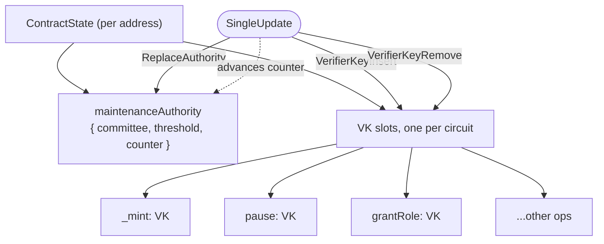
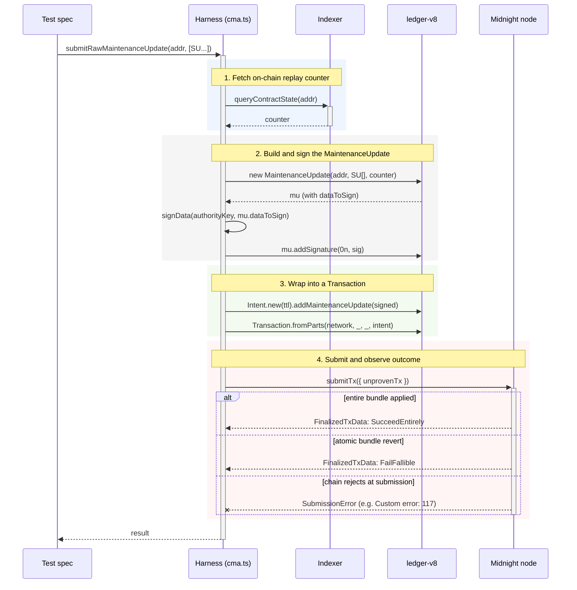

# Integration tests

End-to-end specs that drive the OpenZeppelin Compact modules against a real local Midnight stack (proof-server + indexer + node). For how to run them, see the root [README](../../../README.md#integration-tests).

## Structure

- **`specs/`** — what runs in CI. Grouped by surface under test (`accessControl/`, `cma/`, `upgrades/`, plus a top-level `smoke.spec.ts`).
- **`fixtures/`** — per-contract deploy + handle factories. `testTokenV1.ts` returns a kit (deployer wallet, signer pool, ledger reader); `testTokenV2.ts` exposes `bindAsV2(kit, alias)` for the upgrade specs.
- **`_harness/`** — cross-cutting helpers: CMA wrappers (`cma.ts`), provider builders, network config, the shared `WalletPool` (singleton across the suite).
- **`_mocks/`** — test-only `.compact` contracts (the `TestToken` composite, V1 and V2).

Three pre-funded signer aliases (`ADMIN`, `ALICE`, `BOB`) come from the dev-preset Midnight node; the deployer alias is `GENESIS` and lives on `kit.wallet`.

## Contract Maintenance Authority (CMA)

The CMA is the on-chain entity that owns upgrade-style operations on a deployed Compact contract. Every contract carries a `ContractMaintenanceAuthority` in its `ContractState`:

```
maintenanceAuthority: {
  committee:  SigningKey[]   // signers
  threshold:  bigint         // m-of-n
  counter:    bigint         // monotonic, replay protection
}
```

…plus one verifier-key (VK) slot per circuit (`_mint`, `pause`, `grantRole`, `transfer`, …). The chain only mutates these via a `MaintenanceUpdate` tx that:

1. carries a list of `SingleUpdate`s,
2. is signed by the current authority, and
3. is built against the current `counter`.

Each successful tx is signed against the current `counter` and the chain rejects any `MaintenanceUpdate` whose counter doesn't match (replay protection — see the stale-counter spec below). For 1-SU txs the counter advances by exactly 1; the per-SU vs per-tx delta for N-SU bundles is **not pinned by this suite** — the bundle specs assert `status` and slot state but don't read the counter — so treat it as an open question for now. Bundles apply atomically: every `MaintenanceUpdate` either `SucceedEntirely` or `FailFallible`s and reverts as a unit.

`SingleUpdate` variants (from `@midnight-ntwrk/ledger-v8`):

- `VerifierKeyInsert(opName, vk)` — populate an empty VK slot
- `VerifierKeyRemove(opName)` — clear an occupied slot (decommission a circuit)
- `ReplaceAuthority(newAuthority)` — rotate the authority itself; must be solo in its bundle

### On-chain shape an update mutates



### Read APIs (indexer-backed)

Wrapped in [`_harness/cma.ts`](_harness/cma.ts) over `providers.publicDataProvider.queryContractState`:

- `readContractState(providers, addr)` → raw `ContractState | undefined`
- `readAuthority(providers, addr)` → `{ committee, threshold, counter }`
- `readCmaCounter(providers, addr)` → `bigint`

### Write APIs

Two paths:

#### High-level SDK (`@midnight-ntwrk/midnight-js-contracts`)

One `SingleUpdate` per tx, hides counter and signing plumbing:

- `deployed.circuitMaintenanceTx[op].insertVerifierKey(vk)`
- `deployed.circuitMaintenanceTx[op].removeVerifierKey()`
- `deployed.contractMaintenanceTx.replaceAuthority(newKey)`

#### Raw `ledger-v8`

Multi-SU bundles with manual counter and signing — required to probe protocol-level rules the SDK guards against (multi-update bundles, stale-counter forging, empty-committee freezes, cross-contract replay, …):

```
new MaintenanceUpdate(addr, SingleUpdate[], counter)
  → signData(authorityKey, mu.dataToSign)
  → mu.addSignature(0n, sig)
  → Intent.new(ttl).addMaintenanceUpdate(signed)
  → Transaction.fromParts(networkId, _, _, intent)
  → submitTx(providers, { unprovenTx })
```

### Submission flow (raw path)



### Harness wrappers

Defined in [`_harness/cma.ts`](_harness/cma.ts):

- `rotateCircuitVK(providers, deployed, op, newVk?)` — SDK `remove + insert` round-trip; counter advances by 2 (two single-SU txs)
- `rotateAuthority(deployed, newKey)` — SDK `replaceAuthority`
- `freeze(deployed)` — single-signer abandoned-key freeze (sample a key, install it, drop the bytes)
- `submitRawMaintenanceUpdate(providers, addr, updates, counterOverride?)` — raw multi-SU submission; `counterOverride` lets tests forge a stale counter

## Spec coverage

What each spec proves about CMA / upgrade behaviour. Question IDs (Q1–Q10) cross-reference the [Notes / open questions](#notes--open-questions) table below.

### Baseline

- **Smoke** ([`specs/smoke.spec.ts`](specs/smoke.spec.ts)) — proves the composite `TestToken` deploys to the local node and the constructor leaves `Initializable.isInitialized = true`, `Pausable.isPaused = false`, FungibleToken `name` / `symbol` / `decimals` round-tripped, `totalSupply = 0`, and `AccessControl.DEFAULT_ADMIN_ROLE` exposed as a 32-byte ledger field.
- **AccessControl — multi-signer role gating** ([`specs/accessControl/callers.spec.ts`](specs/accessControl/callers.spec.ts)) — proves `DEFAULT_ADMIN_ROLE` is granted to `ADMIN` during fixture bootstrap, `ADMIN` can grant and revoke `MINTER_ROLE` on `ALICE`, and `BOB` (no admin) is rejected when attempting to grant a role.

### CMA chain-level behaviour

- **Rotation** ([`specs/cma/rotation.spec.ts`](specs/cma/rotation.spec.ts)) — proves `replaceAuthority` installs a new signing key and bumps the CMA counter by 1, the rotated key authorises further maintenance updates, and the pre-rotation key is rejected afterwards.
- **Freeze** ([`specs/cma/freeze.spec.ts`](specs/cma/freeze.spec.ts)) — proves a maintenance update is accepted before freezing (sanity), `freeze()` advances the CMA counter by 1, and every subsequent maintenance update signed by a wrong key is rejected (the abandoned-key freeze pattern works).
- **Empty-committee freeze (Q9)** ([`specs/cma/emptyCommitteeFreeze.spec.ts`](specs/cma/emptyCommitteeFreeze.spec.ts)) — proves `ReplaceAuthority(committee=[], threshold=1)` is rejected at submission (`Custom error: 117`), so the abandoned-key pattern in `freeze.spec.ts` is the only viable freeze path.
- **Stale counter (Q6)** ([`specs/cma/staleCounter.spec.ts`](specs/cma/staleCounter.spec.ts)) — proves a `MaintenanceUpdate` built against a counter the chain has already moved past is rejected at submission (replay protection holds).
- **Cross-contract replay (Q8)** ([`specs/cma/crossContractReplay.spec.ts`](specs/cma/crossContractReplay.spec.ts)) — proves a tx whose `MaintenanceUpdate` is addressed to contract B but signed with A's key is rejected — `dataToSign` is address-bound.
- **Single-bundle multi-update (Q2 / Q4)** ([`specs/cma/multiUpdate.spec.ts`](specs/cma/multiUpdate.spec.ts)) — proves `[remove, insert]` for the same op is accepted and bumps the counter (sanity), two `ReplaceAuthority` in one bundle are rejected at submission (`Custom error: 117`), and two `VerifierKeyInsert` on the same op are accepted by the chain but the bundle reverts atomically (`status: 'FailFallible'`, `_mint` stays undefined).
- **Multi-VK bundles on different ops (Q10)** ([`specs/cma/multiVkBundle.spec.ts`](specs/cma/multiVkBundle.spec.ts)) — proves multi-`Insert` on different empty slots, multi-`Remove` on different occupied slots, and mixed `Insert + Remove` on different ops are all accepted entirely (`SucceedEntirely`) — this is the realistic multi-circuit upgrade path.
- **Mixed bundles (Q7)** ([`specs/cma/mixedBundle.spec.ts`](specs/cma/mixedBundle.spec.ts)) — proves `[ReplaceAuthority, VerifierKeyInsert]` and the reverse ordering are both rejected at submission, confirming any bundle containing a `ReplaceAuthority` must be solo.
- **VK coexistence (Q4 SDK side)** ([`specs/upgrades/vkCoexistence.spec.ts`](specs/upgrades/vkCoexistence.spec.ts)) — proves `insertVerifierKey` is rejected client-side by the SDK when the op (`_mint`) already has an active VK.

### Upgrade pathway (V1 → V2 via VK rotation)

- **State survival across VK rotation** ([`specs/upgrades/stateSurvival.spec.ts`](specs/upgrades/stateSurvival.spec.ts)) — proves every ledger field is preserved and the CMA counter advances by 2 when rotating the `pause`, `_mint`, `grantRole`, and `transfer` VKs in turn.
- **Functional re-verification after rotation** ([`specs/upgrades/functionalReverification.spec.ts`](specs/upgrades/functionalReverification.spec.ts)) — proves post-rotation circuits still work end-to-end: `_mint` increments the recipient balance, `pause` pauses the contract, `grantRole` lets `ADMIN` grant `MINTER` to `ALICE`, and `transfer` moves balances `ALICE → BOB`.
- **Cross-module isolation under VK rotation** ([`specs/upgrades/crossModuleIsolation.spec.ts`](specs/upgrades/crossModuleIsolation.spec.ts)) — proves rotating one module's VK does not disturb sibling-module state: `BOB`'s balance survives an AccessControl `grantRole` rotation, `ALICE`'s `MINTER` role survives a FungibleToken `_mint` rotation, the paused state survives a `_mint` rotation, and `Initializable.isInitialized = true` survives a Pausable `pause` rotation.
- **Semantic V1 → V2 upgrade** ([`specs/upgrades/versionUpgrade.spec.ts`](specs/upgrades/versionUpgrade.spec.ts)) — proves CMA-driven semantic changes land correctly: `_mint` rotation enforces a V2 per-tx cap that V1 would have allowed; `pause` rotation gates pausing on the admin role (`ADMIN` accepted, `BOB` rejected); `transferOwnership` rotation lifts the V1 `ContractAddress` guard while still serving EOA destinations; `_unsafeTransferOwnership` is decommissioned (rejected via the V1 handle and not even surfaced on V2 since the circuit is dropped); and a brand-new V2 `mintBatch` circuit is inserted via `VerifierKeyInsert` (Q1), triples the recipient's balance, and leaves the sibling `_mint` slot undisturbed.

## Notes / open questions

Working record of what we've learned about Compact's CMA / VK upgrade pathway from running these tests. Update when a new spec resolves an open question.

| # | Question | Status | Where |
|---|---|---|---|
| Q1 | `VerifierKeyInsert` for a brand-new operation name? | ✅ | `versionUpgrade.spec.ts` (mintBatch describe) — chain accepts. |
| Q2 | Two `ReplaceAuthority` in one bundle? | ✅ | Chain rejects the tx at submission (substrate `1010: Invalid Transaction: Custom error: 117`). Pinned in `multiUpdate.spec.ts`. |
| Q3 | CMA state queryable via indexer without a tx? | ✅ | `_harness/cma.ts` readers (`readAuthority`, `readCmaCounter`) used by every CMA spec. |
| Q4 | Multiple VK versions live on the same slot? | ✅ | Two layers: the SDK rejects client-side (`vkCoexistence.spec.ts`), and at the chain level a hand-built bundle with two `VerifierKeyInsert`s on the same op finalises `status: 'FailFallible'` and reverts the whole `MaintenanceUpdate` atomically — neither insert persists. Pinned in `multiUpdate.spec.ts`. |
| Q5 | Events emitted on `MaintenanceUpdate`? | ⏳ | Not probed. |
| Q6 | Stale-counter `MaintenanceUpdate` rejected? | ✅ | Yes. Replay protection works as documented — chain rejects at submission. Pinned in `staleCounter.spec.ts`. |
| Q7 | `ReplaceAuthority` mixed with other `SingleUpdate` kinds in one bundle? | ✅ | Chain rejects in both orderings (`Custom error: 117`). Together with Q2, suggests the rule "any bundle containing a `ReplaceAuthority` must contain *only* that one SU." Pinned in `mixedBundle.spec.ts`. |
| Q8 | Cross-contract signature replay (sign for A, address to B)? | ✅ | Chain rejects — `dataToSign` is address-bound. Pinned in `crossContractReplay.spec.ts`. |
| Q9 | Empty-committee `ReplaceAuthority(committee=[], threshold=1)` accepted by chain? | ✅ | No. Chain rejects at submission (`Custom error: 117`). The "abandoned-key" workaround in `freeze.spec.ts` is therefore the only viable freeze pattern. Pinned in `emptyCommitteeFreeze.spec.ts`. |
| Q10 | VK-only multi-update bundles on **different** ops (Insert+Insert, Remove+Remove, Insert+Remove)? | ✅ | All three shapes accepted entirely (`status: 'SucceedEntirely'`). Confirms the realistic multi-circuit upgrade path. Combined with Q2 / Q4 / Q7, the bundle-shape rules now read: VK-only bundles work on different ops; same-op multi-insert atomic-reverts; any bundle containing a `ReplaceAuthority` must be solo. Pinned in `multiVkBundle.spec.ts`. |
| Q11 | Counter delta for an N-SU bundle: `+1` per tx or `+N` per SU? | ⏳ | Not pinned — `multiVkBundle.spec.ts` doesn't read counter deltas. Single-SU txs confirmed `+1` (`staleCounter.spec.ts` setup). |

Status: ✅ Answered · ◐ Partial · ⏳ Open
