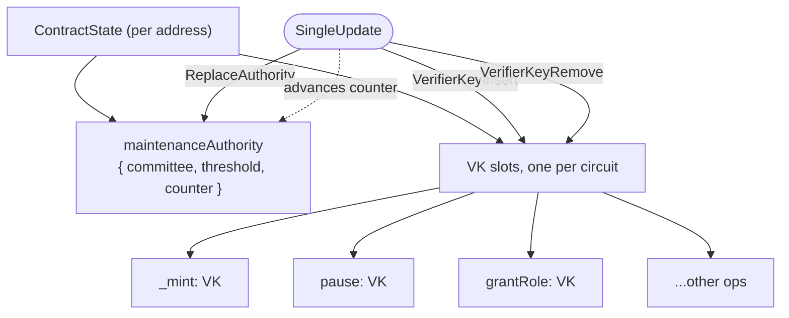
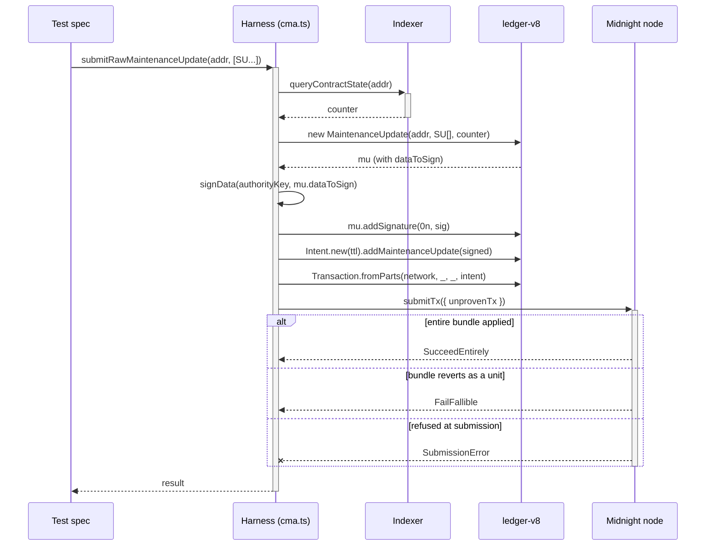

# Integration tests

Compose multiple production modules into one top-level contract and drive it
through the simulator, covering interactions the per-module unit tests can't.

```sh
yarn test:integration
```

Some specs need a chain rather than the simulator — the Contract Maintenance
Authority has no dry equivalent. Those are gated on `isLiveBackend()`, so the
command above skips them. To run them, bring up the local stack and use the
live variant:

```sh
make env-up
yarn test:integration:live
```

## Layout

- `specs/` — grouped by the surface under test (`accessControl/`, `cma/`,
  `upgrades/`, plus a top-level `smoke.spec.ts`).
- `fixtures/` — per-contract deploy factories. `testTokenV1.ts` deploys and
  returns a kit; `testTokenV2.ts` supplies V2's verifier keys and a V2-shaped
  handle on the V1 contract.
- `_harness/` — the CMA wrappers, the provider builder, and caller identity.
  Wallets, network config and the live setup come from
  [`test-utils/harness`](../../test-utils/harness).
- `_mocks/` — test-only `.compact` contracts.

### Callers

The access modules derive identity from a secret key the caller injects
through a `wit_*SK` witness, not from the wallet that submits the tx. An alias
here is therefore a private state: `kit.as('ADMIN')` returns a handle whose
witnesses answer with `ADMIN`'s key, and every alias pays from the same funded
deployer wallet. `_harness/identity.ts` owns the alias keys and the account-id
derivation.

Specs that need a raw `DeployedContract` — the CMA maintenance surface, which
the simulator's `LiveContext` does not expose — deploy through
`_harness/deploy.ts` and borrow the worker's wallets via
`test-utils/harness/livePool.ts`.

## Contract Maintenance Authority

Every deployed contract carries a `ContractMaintenanceAuthority` in its
`ContractState`:

```
maintenanceAuthority: {
  committee:  SigningKey[]   // signers
  threshold:  bigint         // m-of-n
  counter:    bigint         // monotonic, replay protection
}
```

alongside one verifier-key slot per circuit (`_mint`, `pause`, `grantRole`, …).
Both are mutated only by a `MaintenanceUpdate` tx, which carries a list of
`SingleUpdate`s, is signed by the current authority, and is built against the
current counter.

`SingleUpdate` comes in three shapes, from `@midnight-ntwrk/ledger-v8`:

- `VerifierKeyInsert(op, vk)` — fill an empty slot
- `VerifierKeyRemove(op, version)` — clear an occupied slot
- `ReplaceAuthority(authority)` — rotate the authority itself


```mermaid
flowchart TB
  SU(["SingleUpdate"])
  CS["ContractState (per address)"]

  CS --> CMA["maintenanceAuthority<br/>{ committee, threshold, counter }"]
  CS --> Slots["VK slots, one per circuit"]
  Slots --> M["_mint: VK"]
  Slots --> P["pause: VK"]
  Slots --> G["grantRole: VK"]
  Slots --> O["...other ops"]

  SU -->|VerifierKeyInsert| Slots
  SU -->|VerifierKeyRemove| Slots
  SU -->|ReplaceAuthority| CMA
  SU -.advances counter.-> CMA
```

### Two write paths

The SDK wraps exactly one `SingleUpdate` per tx and hides the counter and
signing:

- `deployed.circuitMaintenanceTx[op].insertVerifierKey(vk)`
- `deployed.circuitMaintenanceTx[op].removeVerifierKey()`
- `deployed.contractMaintenanceTx.replaceAuthority(newKey)`

Anything the SDK guards against — multi-update bundles, a forged counter, an
empty committee, a signature addressed elsewhere — needs the ledger objects
built and signed by hand. `submitRawMaintenanceUpdate` in
[`_harness/cma.ts`](_harness/cma.ts) is that path:


```mermaid
sequenceDiagram
  participant Spec as Test spec
  participant H as Harness (cma.ts)
  participant I as Indexer
  participant L as ledger-v8
  participant N as Midnight node

  Spec->>+H: submitRawMaintenanceUpdate(addr, [SU...])
  H->>+I: queryContractState(addr)
  I-->>-H: counter
  H->>L: new MaintenanceUpdate(addr, SU[], counter)
  L-->>H: mu (with dataToSign)
  H->>H: signData(authorityKey, mu.dataToSign)
  H->>L: mu.addSignature(0n, sig)
  H->>L: Intent.new(ttl).addMaintenanceUpdate(signed)
  H->>L: Transaction.fromParts(network, _, _, intent)
  H->>+N: submitTx({ unprovenTx })
  alt entire bundle applied
    N-->>H: SucceedEntirely
  else bundle reverts as a unit
    N-->>H: FailFallible
  else refused at submission
    N--xH: SubmissionError
  end
  deactivate N
  H-->>-Spec: result
```

### Harness wrappers

- `rotateCircuitVK(providers, deployed, op, newVk?)` — remove then insert, two
  txs, counter +2
- `rotateAuthority(deployed, newKey)`
- `freeze(deployed)` — install a key and discard it
- `submitRawMaintenanceUpdate(providers, addr, updates, counterOverride?)`

## What the specs establish

### Baseline

- [`smoke`](specs/smoke.spec.ts) — the composed mock deploys and every module's
  initial ledger reads back.
- [`accessControl/witnessIdentity`](specs/accessControl/witnessIdentity.spec.ts)
  — role checks follow the witness key, not the submitting wallet.

### CMA behaviour

- [`cma/rotation`](specs/cma/rotation.spec.ts) — `replaceAuthority` installs a
  new key and advances the counter; the new key works, the old one does not.
- [`cma/freeze`](specs/cma/freeze.spec.ts) — rotating to a discarded key ends
  maintenance for good.
- [`cma/emptyCommitteeFreeze`](specs/cma/emptyCommitteeFreeze.spec.ts) — an
  empty committee is refused, so the discarded-key freeze is the only route.
- [`cma/staleCounter`](specs/cma/staleCounter.spec.ts) — an update signed
  against a superseded counter is refused.
- [`cma/crossContractReplay`](specs/cma/crossContractReplay.spec.ts) — a
  signature is bound to the contract it names.
- [`cma/multiUpdate`](specs/cma/multiUpdate.spec.ts) — two `ReplaceAuthority`s
  in one bundle are refused; two inserts on one operation produce a tx the
  chain accepts and a bundle that reverts whole.
- [`cma/multiVkBundle`](specs/cma/multiVkBundle.spec.ts) — verifier-key bundles
  across different operations apply in full, in all three shapes.
- [`cma/mixedBundle`](specs/cma/mixedBundle.spec.ts) — a `ReplaceAuthority`
  cannot share a bundle with another kind, in either order.

### Upgrade pathway

- [`upgrades/vkCoexistence`](specs/upgrades/vkCoexistence.spec.ts) — the SDK
  refuses a second key on an occupied slot, so an upgrade is always a sequenced
  remove-then-insert.
- [`upgrades/stateSurvival`](specs/upgrades/stateSurvival.spec.ts) — a rotation
  leaves a heterogeneous ledger untouched and advances the counter by 2.
- [`upgrades/functionalReverification`](specs/upgrades/functionalReverification.spec.ts)
  — every rotated circuit still proves and verifies.
- [`upgrades/crossModuleIsolation`](specs/upgrades/crossModuleIsolation.spec.ts)
  — rotating one module's circuit leaves sibling modules' state alone.
- [`upgrades/versionUpgrade`](specs/upgrades/versionUpgrade.spec.ts) — a V1→V2
  bump lands a tightened body, a new authorization gate, a relaxed guard, a
  decommissioned circuit, and a circuit V1 never had.

## Bundle rules, as observed

| Bundle | Outcome |
|---|---|
| One `SingleUpdate` | Applied. Counter +1. |
| Verifier-key updates on different operations | Applied in full (`SucceedEntirely`), in any mix of insert and remove. |
| Two inserts on the same operation | Tx finalizes `FailFallible`; the bundle reverts whole, so neither insert lands. |
| More than one `ReplaceAuthority` | Refused at submission. |
| `ReplaceAuthority` alongside any other kind | Refused at submission, in either order. |
| `ReplaceAuthority(committee=[])` | Refused at submission. A CMA keeps at least one key. |

Not yet pinned: whether an N-update bundle advances the counter by 1 or by N —
the bundle specs assert status and slot state, not counter deltas. Single-update
txs are confirmed at +1. Nor is it known whether a `MaintenanceUpdate` emits
events.
