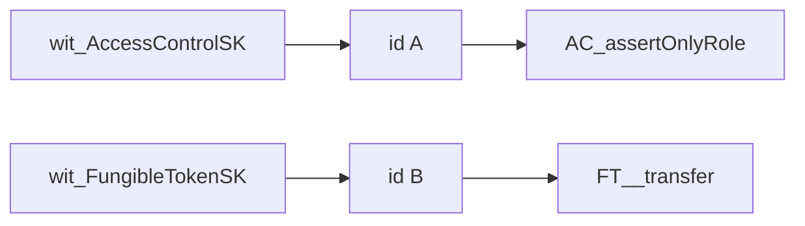
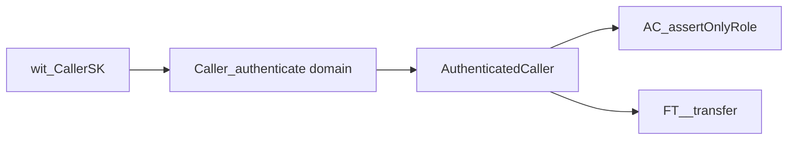

# Witness-agnostic modules: single identity authority

Status: **implemented** on branch `refactor/witness-agnostic-modules`. Target release:
next alpha, after the 0.3.0-alpha.1 audit closes. See §8 for what landed and §9 for
the two design points that changed once it met real code.

Owner: 0xisk. Reviewer: Andrew Fleming.

Origin: the "Write Refactor Documentation" action item from **Midnight Release
Planning/Catch-up, 2026-07-28** (aligned decision: "the authentication logic will be
refactored into witness-agnostic modules for the next alpha release").

## TL;DR

- A module that derives its own caller from its own witness is unsound under
  composition (audit L-06, platform tag L-03).
- The meeting agreed to make modules witness-agnostic. That direction holds.
- The form discussed there, dropping witnesses and passing the principal as a raw
  parameter, does not ship as-is. It deletes the safe-by-default surface and it
  worsens linkability.
- Amendment: **one identity module owns the only identity witness** and returns a
  typed principal. Modules take the type. Never a secret, never a bare `Bytes<32>`.
- The goal is one witness and one authority, not zero witnesses.

## 1. The problem

Each module derives the caller from its own witness:

| Module | Witness | Derivation |
| --- | --- | --- |
| `Ownable` | `wit_OwnableSK` (`access/Ownable.compact:108`) | `Utils_computeAccountId` |
| `AccessControl` | `wit_AccessControlSK` (`access/AccessControl.compact:166`) | `Utils_computeAccountId` |
| `FungibleToken` | `wit_FungibleTokenSK` (`token/FungibleToken.compact:112`) | `Utils_computeAccountId` |
| `NonFungibleToken` | `wit_NonFungibleTokenSK` (`token/NonFungibleToken.compact:155`) | `Utils_computeAccountId` |
| `MultiToken` | `wit_MultiTokenSK` (`token/MultiToken.compact:174`) | `Utils_computeAccountId` |
| `ConfidentialFungibleToken` | `wit_ConfidentialTokenSK` (`token/ConfidentialFungibleToken.compact:309`) | local `computeAccountId` |

A witness is prover-supplied off-chain code. Nothing constrains two witnesses in one
circuit to return the same value.

Consequence: a composed circuit binds its authorization and its effect to two unrelated
identities.



Nothing relates `A` to `B`. Each half is sound alone; only the pairing is unconstrained.

### What an attacker gains

- No theft from a key they lack. Passing a witness means holding the secret.
- **Gate bypass.** The attacker owns both identities: clean id `A` (allowlisted, empty)
  and blocked id `B` (holds funds). `A` satisfies the wrapper's policy check, `B` receives
  the effect.
- **Honest-wallet miscredit.** A wallet resolving the two witnesses from different key
  material authorizes as one account and moves another's value. No attacker needed.

### Why a wrapper cannot repair it today

- `_computeAccountId()` is non-exported in every module (`Ownable.compact:337`,
  `AccessControl.compact:444`, `FungibleToken.compact:715`, `NonFungibleToken.compact:926`,
  `MultiToken.compact:699`).
- The gates return nothing to compare against: `AC_assertOnlyRole` returns `[]`
  (`AccessControl.compact:218`), `FT_transfer` returns `Boolean`
  (`FungibleToken.compact:276`).
- Re-deriving in the wrapper adds a third unconstrained witness read.

### The second driver: C2C

Separate from the audit. A contract-to-contract call cannot supply the callee's witnesses,
so any module holding a witness is C2C-hostile. This was the original motivation raised in
the meeting (00:41:20) and it is **not** solved by parameterising the principal: a contract
caller has no secret key, so a `caller` parameter is only the calling contract's word.

## 2. What the meeting aligned on

From the transcript (00:36:28 to 00:39:39):

- Move authentication logic out of the modules.
- The principal becomes an explicit circuit parameter. Andrew: "unsafe transfer from, first
  parameter would be spender in the core module."
- Keep a small `computeAccountId(sk)` helper module.
- The top-level contract declares the witness once and threads it through the stack.
- Andrew: "we don't do anything with authentication and we leave that entirely up to the
  implementing contracts."

Concerns raised in the meeting itself:

- "Really easy to screw up from a user perspective" (00:41:20).
- Per-module witness names exist so an FT secret is not conflated with an Ownable secret,
  "because that's also an issue" (00:39:39).
- `disclose()` gets harder across nested modules (00:47:28).
- Breaking change for every downstream user (00:49:11).

## 3. Why the raw-parameter form is not shippable

### 3.1 It deletes the safe-by-default surface

- `FT__transfer(from, to, value)` is already exported today (`FungibleToken.compact:462`),
  so unsafe-by-default is not new.
- What changes: it becomes the **only** surface. `FT_transfer(to, value)`, which can only
  ever debit the witness holder, disappears.
- An integrator re-exporting the survivor ships a permissionless transfer-from-anyone
  circuit.
- Precedent for how bad this gets: the `DANGER` block at
  `ConfidentialFungibleToken.compact:537-550` exists because `export circuit` cannot be
  restricted and a raw re-export of `_credit` / `_mint` is catastrophic. The raw-parameter
  refactor gives every value circuit that shape.
- Net trade: one Low becomes an easily-shipped Critical.

### 3.2 It relocates the binding, it does not enforce it

- Nothing stops the top-level contract calling `wit_SK()` twice, or passing `callerA` to
  the gate and `callerB` to the effect.
- Compact has no read-this-witness-once rule.
- Real gain: the mistake becomes local to one reviewable file instead of split across
  module internals. That is auditability, not a guarantee.

### 3.3 It worsens linkability unless H-01 lands with it

- `Utils_computeAccountId(sk) = persistentHash([sk])` (`utils/Utils.compact:157`), with no
  domain separation. This is audit H-01.
- CFT derives identically (`ConfidentialFungibleToken.compact:1037`).
- One secret threaded across modules therefore yields **one identical `accountId`** used as
  a ledger `Map` key everywhere, in every deployment.
- Witness-agnostic with H-01 unfixed is a linkability regression. The two findings must be
  fixed in one change.

### 3.4 Disclose burden moves into integrator code

- Today the witness read sits beside the ledger op, inside a module we audit, so the
  `disclose()` is ours.
- As a parameter the secret is a taint source crossing a module boundary. Downstream ledger
  writes need `disclose()` at the integrator's level.
- In nested compositions the compiler error surfaces at the top-level contract, where the
  integrator has no context for it.
- `ShieldedAccessControl` is the concrete case Andrew cited: a value is hashed and its
  derivative stored on the ledger, so it must be disclosed.
- `disclose()` in user code is where privacy bugs get introduced.

### 3.5 Secrets reach exported signatures

- Identity witnesses are non-exported today, so a secret cannot appear in a deployed
  contract's ABI.
- `export circuit transfer(sk: Bytes<32>, to, value)` puts it in a public entry point's
  witness-input position. Still private, but a new surface for mistakes.

### 3.6 It does not deliver the C2C goal

- See §1. A contract caller has no secret key.
- Contract-caller authentication has to come from the runtime, not a parameter.
- No `caller()` primitive appears in the stdlib copy checked (VS Code extension 0.2.13
  bundle: `own_public_key`, `kernel.self` only). **Verify against the Stagenet RC stdlib
  before assuming either way.**
- As specified, the refactor makes modules C2C-*callable* but not C2C-*authorizing*.

## 4. Amended proposal

Same decision. The amendment is *what type flows as the parameter*.

### 4.1 The identity modules

Two modules ship rather than one. Business modules have to name the caller type
without inheriting a witness, because no other contract can call a module that
declares one.

`src/access/Principal.compact` holds the type and the derivation. No witness, no ledger.
The business modules import this one.

```compact
export struct AuthenticatedCaller {
  principal: Bytes<32>;  // domain-separated account identifier
  domain: Bytes<32>;     // the deployment domain it was derived under
}

export pure circuit SCHEME_TAG(): Bytes<32> {
  return pad(32, "Principal:v1");
}

export pure circuit derivePrincipal(
                      secretKey: Bytes<32>,
                      domain: Bytes<32>
                      ): Bytes<32> {
  return persistentHash<Vector<3, Bytes<32>>>([secretKey, domain, SCHEME_TAG()]);
}
```

`src/access/Caller.compact` holds the only identity witness in the library. Imported by
the composing contract, never by a business module.

```compact
witness wit_CallerSK(): Bytes<32>;

export circuit authenticate(domain: Bytes<32>): Principal_AuthenticatedCaller {
  return Principal_authenticatedCallerFrom(wit_CallerSK(), domain);
}

export circuit authenticateForThisContract(): Principal_AuthenticatedCaller {
  return Principal_authenticatedCallerFrom(wit_CallerSK(), kernel.self().bytes);
}
```

`Principal` also exports `asAccount(caller)` (the `Either<Bytes<32>, ContractAddress>`
shape the ledger uses), `authenticatedCallerFrom(sk, domain)`, and an optional
`assertDomain(caller, expected)`.

This is not a new invention. `ShieldedAccessControl` already derives exactly this shape:

```compact
// access/ShieldedAccessControl.compact:808
export pure circuit computeAccountId(secretKey: Bytes<32>, instanceSalt: Bytes<32>) {
  return persistentHash<Vector<3, Bytes<32>>>(
           [secretKey, instanceSalt, pad(32, "ShieldedAccessControl:accountId")]
         ) as AccountIdentifier;
}
```

The proposal generalizes SAC's derivation to the whole library and removes the per-module
witness.

### 4.2 Modules consume the type

```compact
// before
export circuit approve(spender: Either<Bytes<32>, ContractAddress>, value: Uint<128>): []
// reads wit_FungibleTokenSK internally

// after
export circuit approve(
  caller: AuthenticatedCaller,
  spender: Either<Bytes<32>, ContractAddress>,
  value: Uint<128>
): []
```

Composition becomes single-principal by construction:



### 4.3 `domain` is per-instance, not per-module

Design decision, and the one that makes the scheme work.

- **Rejected:** a per-module domain tag (`"FungibleToken"`, `"AccessControl"`). It gives
  each module a different `principal` for the same secret, so the gate id and the effect id
  differ again and cross-module comparison is impossible. This defeats the purpose.
- **Chosen:** the domain is a per-deployment instance salt, chosen by the composing
  contract. One contract, one principal, shared by every module it drives.
- **Corrected during implementation:** the salt is a value the contract STORES at
  deploy time, not `kernel.self()`. `kernel.self()` looked attractive (no storage, no
  init argument) but it cannot be precomputed while the deploy transaction is being
  built, so a constructor cannot NAME a principal, and `Ownable.initialize(initialOwner)`
  becomes unusable. `Caller_authenticate(storedDomain)` is therefore the recommended
  entry point, and `authenticateForThisContract()` is kept for contracts where nobody
  has to be named before the address exists (a token whose users register themselves).
  This is the same shape as `ShieldedAccessControl._instanceSalt`.
- Unlinkability is therefore *across deployments*, which is the granularity that matters.
  Within one contract a single caller identity is the point.
- Because `derivePrincipal` is `pure`, a wallet (or a deploy script) computes a
  principal off-chain with no proof. That is what makes an initial owner or a
  pre-granted role holder expressible.
- Same mechanism as SAC's `_instanceSalt`, and it also addresses N-08 ("owner commitments
  are not truly distinct over multiple contracts").
- Trade-off against Andrew's separate-secrets point (00:39:39): within one contract a user
  can no longer hold distinct FT and Ownable identities by default. An integrator wanting
  that calls `authenticate` twice with different salts and accepts that cross-module gating
  no longer applies. Document as an explicit escape hatch with a warning.

### 4.4 What each §3 issue costs after the amendment

| Issue | Status |
| --- | --- |
| 3.1 unsafe default | Fixed. Type-level split between an id handed in (`Bytes<32>`) and an id authenticated (`AuthenticatedCaller`). Raw-principal internals stay non-exported so the compiler blocks the footgun re-export. |
| 3.2 relocated binding | Improved, not solved. See caveat below. |
| 3.3 linkability / H-01 | Fixed together. Domain-separated derivation with an instance salt. |
| 3.4 disclose | Contained. The secret never leaves the identity module. |
| 3.5 secret in ABI | Gone. Exported signatures carry a principal, never a secret. |
| 3.6 C2C | Addressable additively. See §4.6. |

### 4.5 Caveat, to be stated plainly to auditors

- Compact structs are not opaque and cannot be made unforgeable. An integrator can
  hand-build `AuthenticatedCaller { principal: victimId, domain: d }`.
- This stops an integrator mistake. It does not stop integrator malice: a hostile
  integrator controls the whole contract regardless.
- The value: the correct path is the easy path, and the incorrect path requires a
  hand-constructed struct a reviewer will spot.
- Do not claim the refactor makes confused-deputy behavior inexpressible. It makes
  single-derivation natural and double-derivation visible.

### 4.6 C2C extension (later, additive)

```compact
export circuit authenticateContract(domain: Bytes<32>): AuthenticatedCaller;
// principal derived from the runtime caller, no witness
```

- Widen `principal` to `Either<Bytes<32>, ContractAddress>`.
- Business modules do not change; they already consume the struct.
- Blocked on confirming a runtime caller primitive exists in the target stdlib (§3.6).

## 5. Scope

### In scope: the identity witnesses

The five `Utils_computeAccountId` modules, 11 derivation sites:

| Site | Circuit |
| --- | --- |
| `access/Ownable.compact:271` | `assertOnlyOwner` |
| `access/AccessControl.compact:222` | `assertOnlyRole` |
| `access/AccessControl.compact:332` | `renounceRole` |
| `token/FungibleToken.compact:308` | `_unsafeTransfer` |
| `token/FungibleToken.compact:363` | `approve` |
| `token/FungibleToken.compact:432` | `_unsafeTransferFrom` |
| `token/NonFungibleToken.compact:355` | `approve` |
| `token/NonFungibleToken.compact:402` | `setApprovalForAll` |
| `token/NonFungibleToken.compact:504` | `_unsafeTransferFrom` |
| `token/MultiToken.compact:291` | `setApprovalForAll` |
| `token/MultiToken.compact:489` | `_unsafeTransferFrom` |

`transfer` and `transferFrom` authenticate transitively through the `_unsafe*` circuits.

### Out of scope: data witnesses

Drawn from the meeting (00:47:28): a merkle path "you can never do this from circuit".

| Witness | Reason |
| --- | --- |
| `wit_getRoleCommitmentPath` (`ShieldedAccessControl.compact:235`) | TypeScript-side tree operation, cannot be a circuit parameter meaningfully. |
| `wit_secretKey` (`ShieldedAccessControl.compact:248`) | An IDENTITY witness, but a different scheme: commitment-based, and already domain-separated against a stored `_instanceSalt` (`:808`). It is also paired with the path witness above, which cannot be parameterised, so migrating the secret alone would not make the module witness-free. Left in place. |
| `wit_ConfidentialTokenEK` (`CFT:317`) | Bound in-circuit by `ElGamal_assertDecryptsTo`. |
| `wit_PlaintextBalance` (`CFT:337`) | Bound in-circuit by `ElGamal_assertDecryptsTo`. |
| `wit_RandomnessSeed` (`CFT:353`) | Freshness requirement, not an identity. |
| `wit_secretNonce` (`ZOwnablePK.compact:92`) | Third pattern: commitment over `ownPublicKey()` plus a nonce. Treat separately. |
| `wit_ConfidentialTokenSK` (`CFT:309`) | An identity witness, but bound in-circuit against the on-chain `accountId`, and CFT already returns the id it authenticated. Decide after the five simpler modules land. |

CFT is the odd one out overall: witness plus in-circuit binding is a third pattern.

**This matters for the audit response.** Three modules keep their own identity
witness, so `Caller` is the single authority for the migrated set, NOT for the whole
library. A contract driving `ShieldedAccessControl`, `ZOwnablePK` or
`ConfidentialFungibleToken` alongside a migrated module is still composing two
unrelated identities and must assert the relationship itself. Auditor recommendation
3 (state that each module's derived identity is independent of every other's)
therefore still applies to those three, and is documented in their headers and in the
`Caller` module header. Do not describe this change as making the library
single-identity.

## 6. Sequencing against the audit

The refactor obsoletes one remediation option, so the audit response should not build what
the refactor deletes.

**Now, for the 0.3.0-alpha.1 response:**

- L-06 rec 3: document in each module that its derived identity is independent of every
  other module's.
- L-06 rec 2: document the explicit-principal path that already works today,
  `AC_hasRole(role, account)` (`AccessControl.compact:177`) with `FT__transfer(from, ...)`
  (`FungibleToken.compact:462`).
- L-03 (PDF numbering, the `clearMemos` finding): return the authenticated id from
  `clearMemos` (`ConfidentialFungibleToken.compact:995`) and add it to the header
  enumeration. Small and self-contained.

**Skip:**

- Propagating the CFT return-the-id convention to `Ownable` / `AccessControl` /
  `FungibleToken` / `NonFungibleToken` / `MultiToken`. Parameters subsume returns: a wrapper
  that passes the principal already knows it. Building the convention now is throwaway work.

**Next alpha:**

- This refactor, bundled with H-01 (domain separation) per §3.3.
- Communicate before implementing. The meeting flagged the risk of doing the work and then
  being asked to revert it (00:50:58).

## 7. Open questions

- ~~Where does the instance salt come from?~~ **Resolved during implementation:** a
  stored deploy-time value. `kernel.self()` cannot be precomputed before deployment,
  so it cannot support a constructor that names a principal. See §4.3.
- Does a runtime caller primitive exist in the Stagenet RC stdlib (§3.6)? Blocks §4.6.
- Naming. `Caller` module and `AuthenticatedCaller` struct follow the meeting's vocabulary
  (00:34:38: Andrew floated "caller", rejected "self" as colliding with the contract).
- Migration story for downstream users. Every signature changes. Deprecation window, or a
  clean break at the alpha?
- Does `ZOwnablePK` fold into `AuthenticatedCaller`, or stay a separate commitment scheme?

## 8. What landed

Branch `refactor/witness-agnostic-modules`, on top of `docs/monument-usecase`.

### New

| File | Purpose |
| --- | --- |
| `contracts/src/access/Principal.compact` | `AuthenticatedCaller` type, domain-separated derivation, `asAccount`, `assertDomain`. Witness-free. |
| `contracts/src/access/Caller.compact` | The library's only identity witness, `authenticate(domain)` and `authenticateForThisContract()`. |
| `contracts/src/access/test/witnesses/CallerWitnesses.ts` | The single witness implementation, replacing five. |
| `contracts/src/access/test/witnesses/CallerWitnesses.test.ts` | Ported from `OwnableWitnesses.test.ts`. |
| `contracts/src/access/test/mocks/MockCaller.compact` | Exercises the identity modules directly. |
| `contracts/test-utils/fixtures/principal.ts` | TypeScript mirror of the derivation, plus `makePrincipalUser` / `forgedCaller` fixtures. |
| `contracts/test/integration/_mocks/ComposedConfusedDeputy.compact` | Adversarial composed contract: a gate module and an effect module, one circuit doing it right and one doing it wrong. |
| `contracts/test/integration/fixtures/composedConfusedDeputy.ts` | Simulator for the above. |
| `contracts/test/integration/specs/confusedDeputy.spec.ts` | The L-06 regression suite, 7 specs. |

### Migrated

Seven modules. Each lost its identity witness and its non-exported account-id
derivation, and takes `Principal_AuthenticatedCaller` as the first parameter of every
caller-authenticating circuit.

| Module | Circuits |
| --- | --- |
| `access/Ownable` | `assertOnlyOwner`, `transferOwnership`, `_unsafeTransferOwnership`, `renounceOwnership` |
| `access/AccessControl` | `assertOnlyRole`, `renounceRole`, `grantRole`, `revokeRole` |
| `access/ShieldedAccessControl` | `assertOnlyRole`, `canProveRole`, `grantRole`, `revokeRole`, `renounceRole` |
| `token/FungibleToken` | `transfer`, `_unsafeTransfer`, `approve`, `transferFrom`, `_unsafeTransferFrom` |
| `token/MultiToken` | `setApprovalForAll`, `transferFrom`, `_unsafeTransferFrom` |
| `token/NonFungibleToken` | `approve`, `setApprovalForAll`, `transferFrom`, `_unsafeTransferFrom` |
| `token/ConfidentialFungibleToken` | `register`, `_debit`, `_burn`, `transfer`, `_move`, `sweep`, `approve`, `transferFrom`, `clearMemos`, `_spendEscrow`, `_burnFrom` |

`grantRole` / `revokeRole` were not on the original site list in §5: they call
`assertOnlyRole` internally, so they authenticate transitively.

`ShieldedAccessControl` is breaking beyond the signature change. Its accountId scheme
moves from `SHA256(secretKey, instanceSalt, "ShieldedAccessControl:accountId")` to
`Principal_derivePrincipal`, so existing role trees do not carry over. `_instanceSalt`
survives: it still separates role COMMITMENTS across deployments, while the caller
domain separates PRINCIPALS. The spec asserts both separations independently.

`ConfidentialFungibleToken` keeps its three ENCRYPTION witnesses
(`wit_ConfidentialTokenEK`, `wit_PlaintextBalance`, `wit_RandomnessSeed`), each bound
in-circuit against on-chain state. Only its identity witness went.

### Not migrated: `ZOwnablePK`

Deliberate, and the reason is specific rather than a scoping convenience. Its identity
anchor is `ownPublicKey()`, a runtime primitive, identical in every circuit of a
transaction, not choosable by the prover. `wit_secretNonce` supplies a BLINDING
factor: a nonce that disagrees with the stored commitment fails the check rather than
authenticating a different account. Parameterising the identity would delete a binding
the runtime already guarantees.

The residual is stated on that module's header: a contract composing `ZOwnablePK` with
a migrated module holds two unrelated identities (a Zswap coin public key and a
principal) and must bind them itself if they are meant to be the same party.

### Removed

- Five per-module witness files and their specs (`OwnableWitnesses`,
  `AccessControlWitnesses`, `FungibleTokenWitnesses`, `MultiTokenWitnesses`,
  `NonFungibleTokenWitnesses`). All five were structurally identical.
- `Utils_computeAccountId` (`persistentHash([secretKey])`), the H-01 hash itself. It
  had no production callers left after the migration, plus its `MockUtils` wrapper,
  simulator method and spec block.
- `ShieldedAccessControl_computeAccountId` and CFT's `computeAccountId` re-export. Both
  were second names for a job `Principal_derivePrincipal` now does; keeping either
  would mean keeping two schemes in sync.

### Also on this branch

Audit L-03 in the PDF's numbering, the separate `clearMemos` finding: `clearMemos` now
returns `Bytes<32>` and is added to the module header's enumeration of
caller-authenticating circuits.

### The rule this refactor made explicit

A top-level contract must **produce** the caller and never **accept** one:

```compact
// In a module: correct. The composing contract supplies the caller.
export circuit assertOnlyOwner(caller: AuthenticatedCaller): [] { ... }

// In a deployed contract: an authentication bypass. The transaction sender
// chooses the parameter, so they choose which principal every gate sees.
export circuit withdraw(caller: Principal_AuthenticatedCaller, ...): [] { ... }

// In a deployed contract: correct.
export circuit withdraw(...): [] {
  const caller = Caller_authenticate(_callerDomain);
  ...
}
```

Nothing in Compact's type system enforces this, so it is a `@warning` on `Principal`
and `Caller` and it shapes the test surface: every mock in this library is a top-level
contract, so every mock authenticates internally and mirrors its module's exported
signatures exactly. None of them takes a caller parameter.

### The regression surface

Because a correctly-written contract cannot express the divergence, the L-06
regression needs a contract that is wrong on purpose. That is
`ComposedConfusedDeputy` (integration), composing a GATE module (`Ownable`) with an
EFFECT module (`FungibleToken`):

| Circuit | Gate principal | Effect principal | What it shows |
| --- | --- | --- | --- |
| `correctTransfer` | `authenticated()` | the same value | The fix. Owner check and balance debit are provably one account. |
| `deputisedTransfer` | `authenticated()` | `fabricated(actAs)` | The pre-fix default, now reachable only by writing a visible `fabricated()` call. |

The seven specs assert: the in-circuit derivation matches the off-chain mirror; the
debit lands on the principal the gate passed for; an unauthorized caller is rejected;
identity moves as one value across both modules; the fabricated case really does debit
a third party (the §4.5 boundary, pinned so it cannot drift unstated); fabricating the
effect's caller does not fabricate the gate's; and the effect module still enforces its
own invariants against the fabricated account.

### Verification

- Unit suite: **1421 passed, 20 skipped, 0 failed** (40 files).
- Integration suite: **19 passed, 1 skipped** (3 files).
- `tsc --noEmit`: clean. `biome ci`: clean (128 files).
- Live tests did not run. This changes module composition, and every new spec is a
  dry property.

Two multisig artifacts (`MockProposalManager`, `ShieldedMultiSig`) were stale in the
working tree before this branch and were recompiled to get a clean baseline. No
multisig source was touched.

## 9. Cost

`persistentHash` dominates these circuits, and the derivation went from hashing one
32-byte word to three. The shape of the change:

- A circuit that authenticates AND does one module's work costs **more** than before.
  The derivation used to be folded into that same circuit over one word; it is now
  three words.
- A circuit that authenticates once and drives **two or more** modules costs **less**,
  because the derivation is paid once instead of once per module.

Hence the rule documented on `Caller`: authenticate once per transaction, not once per
module wrapper. Per-circuit row counts live on the `@circuitInfo` annotations of each
module, re-measured from compiler output rather than estimated.

If the added rows turn out to matter against a block-limit ceiling, the lever is
`SCHEME_TAG`: dropping it takes the hash from three words to two, at the cost of the
explicit scheme separation H-01 asks for. Not recommended, but it is the knob.
