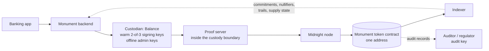
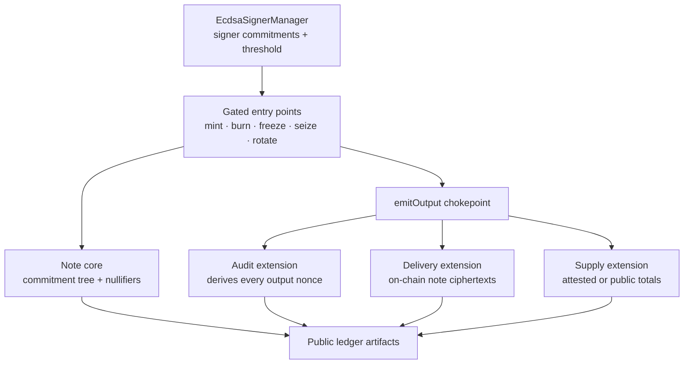
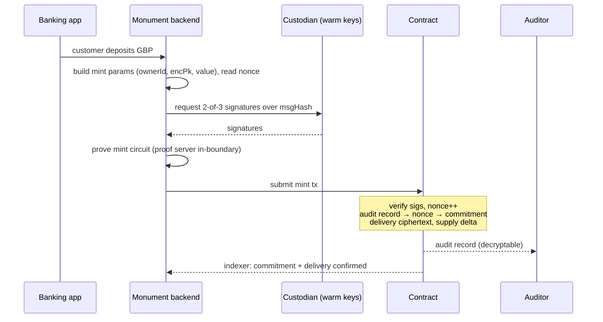
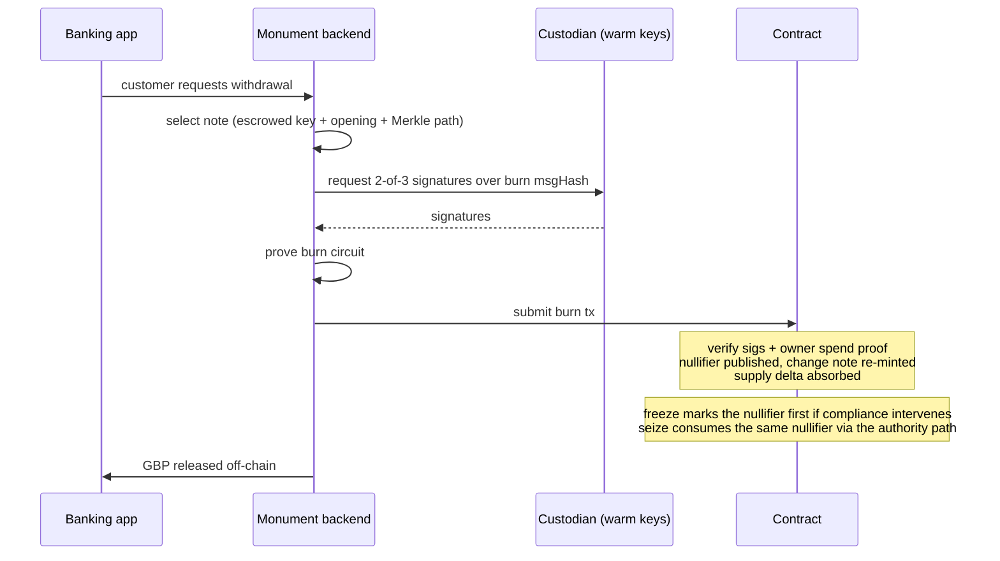

# Monument RWA Token — Specification

> **Status:** draft for review (2026-08-18), written for the Monument Bank tokenized-deposit use case (phase one). Prepared for alignment with the Midnight Foundation: once agreed, this document is the baseline for what will be delivered in the year-end window, and changes to it are scope changes.
>
> **What this is.** A custom RWA token solution for Monument, not a new library standard. It composes two existing OpenZeppelin workstreams — the ConfidentialNoteFungibleToken family (issue [#722](https://github.com/OpenZeppelin/compact-contracts/issues/722), core PR [#743](https://github.com/OpenZeppelin/compact-contracts/pull/743)) and the `multisig/` package — into one deployable contract. The token half and the multisig half each exist today in draft form; **their composition (§6) is the part that has no prior design artifact, and this document is that design.**
>
> **Verification.** Circuit costs are the compiler's own `@circuitInfo` numbers. Every requirement in §2 carries the date and venue where it was agreed. The code referenced is draft: not audited, not production.

This document answers the five questions the specification was commissioned to answer:

1. Is an ECDSA-multisig-controlled, note-based confidential token possible? — §8 (verdict: yes, conditionally; the conditions are named).
2. How do transfers happen? — §5.3, §6.5 (and why phase one deliberately exposes none).
3. How does accounting happen? — §5.4, §6.4, §7.
4. What is done and what is pending? — §10.
5. Is this realistic for the roughly two-month development-plus-audit window? — §11.

## 1. Summary

The Monument RWA token is a **confidential note token under institutional multisig control**. Value lives entirely inside one Compact contract as **notes**: `(value, nonce)` records owned by a per-customer key, represented on the public ledger only by hiding commitments in a Merkle tree and spent by publishing nullifiers. Amounts — including every issuance and redemption — senders, and recipients are all hidden from the public ledger. The issuer keeps the controls a regulated deposit needs: gated mint and burn, freeze, escrow-free seizure, structural auditor visibility, and provable supply. Every privileged operation is authorized by **M-of-N ECDSA signatures** (2-of-3 for phase one), matching how the custodian's HSM infrastructure actually signs.

This is **confidentiality, not unaccountability**. The design makes auditor visibility *structural*: every output note's nonce is derived from an ECDH against the audit key, so a note the auditor cannot open cannot exist (§5.5). The regulator's view is complete by construction, not by participants' good behavior. Concretely, for phase one: customers interact only with Monument's banking app; Monument and its custodian run all keys, proving, and accounting; the public chain shows that activity exists but never what it is; and the auditor sees all of it.

**One contract, one address — by choice, not by platform limitation.** Cross-contract calls are live on Stagenet today (§3); this design deliberately does not use them. The multisig gates and the token compose at compile time into a single deployed contract, which keeps the proving surface, the deploy budget, and the audit scope small, and decouples the Monument timeline from cross-contract availability on mainnet. It also dissolves the two problems that dominated the earlier custodian architecture: per-user contract deployment (no factory pattern, unbounded upgrade burden, address-count leaks) and the cross-contract mint hop that failed with unclaimed-output errors before calls landed. A customer's segregated claim is a note keyed to their identity inside the shared contract — segregation without per-user contracts (§6.7).

## 2. Requirements and provenance

Every row carries where it was agreed, so this table can serve as the scope baseline. "Sync" rows are the BitGo–MNF–OZ working sessions; requirements agreed there are inherited by the current custodian track unless restated.

| # | Requirement | Agreed | Satisfied in |
| --- | --- | --- | --- |
| R1 | 2-of-3 threshold signing is a hard requirement for privileged operations | Sync 2026-05-05 | §6.1 |
| R2 | ECDSA is the authority scheme (operations and contract maintenance) | Sync 2026-06-02 | §6.1, §6.4 |
| R3 | ECDSA signatures: low-s form only (malleability rule) | Tech call 2026-08-03 | §6.1 |
| R4 | Value under multisig custody at every step; no single-sig hop, ever | BitGo architecture doc; sync 2026-06-30 | §6.7 |
| R5 | Mint/burn authority restricted to the issuer; end users cannot burn their own tokens | Sync 2026-07-07 | §6.2 |
| R6 | Custodian API surface: mint, burn, freeze, unfreeze, query total supply / total minted / total burned | Balance call 2026-07-29 | §6.4 |
| R7 | Key topology: admin keys offline; a warm key available 24/7 for mint/burn | Balance call 2026-07-29 | §6.4 |
| R8 | Compliance dataset per transaction: sender, receiver, token type, amount; genesis tracing not required | Sync 2026-07-21, 2026-07-14 | §5.5, §7 |
| R9 | Disclosure/compliance policy fixed before deployment; no post-deployment policy upgrades | Tech call 2026-07-13 | §6.6, §8.5 |
| R10 | A regulator view that exposes all balances under one key is acceptable to Monument | Steering 2026-07-20 | §7 |
| R11 | Honest, non-inflatable supply: holders and the regulator can verify supply was not inflated | Sync 2026-06-18, 2026-07-02 | §5.4, §12-Q2 |
| R12 | Segregated per-customer claims with the chain as the ledger; an omnibus balance with an internal ledger is not acceptable | Sync 2026-06-30, 2026-07-07 | §6.7, §12-Q1 |
| R13 | Phase one scope: bank-managed mint and redeem only; no end-user wallets, no customer-initiated transfers, no DeFi | Sync 2026-05-19, 2026-06-04 | §6.5 |
| R14 | Customers must be able to recover funds if the bank winds down | Sync 2026-04-28 | §12-Q6 |
| R15 | Freeze and seize capability for the RWA/tokenized-deposit track | MNF priority list 2026-06-22 | §5.6, §6.2 |
| R16 | Year-end deadline: development and audit complete early enough for third-party integration to finish in 2026 | 1:1 2026-08-17; MNF roadmap ("Monument Bank Phase 1 LIVE", Q4 2026) | §11 |
| R17 | Phase one is roadmap-gated on designated-party disclosure (`discloseTo`) being available | MNF roadmap, Q4 2026 row | §5.5 |

Rows R12 (omnibus vs. smart account) and R11 (public vs. attested supply) have open sub-questions tracked in §12.

## 3. System overview and interconnection

The system has four trust domains: **Monument** (the bank and its backend), the **custodian** (Balance: key management and signing), the **Midnight chain** (the deployed contract, nodes, indexer), and the **auditor/regulator** (holds the audit decryption key, no spend power).

**How the elements interconnect.** Reading the contract from the outside in:

- **The multisig gate** (`EcdsaSignerManager`, §6.1) holds the signer commitments and threshold. It authorizes; it moves no value.
- **The gated entry points** (§6.2) are the only exported state-changing circuits. Each verifies M-of-N signatures over a message hash that binds the operation, its parameters, the contract address, and a monotonic nonce — then calls the token machinery.
- **The note core** (§5.2) owns the commitment tree and nullifier set: existence, ownership, conservation, single-spend. It is deliberately role-free; all policy lives in the gates above it.
- **The emission chokepoint** (§5.5) is one small circuit every output note passes through: the audit extension derives the note's nonce (auditor completeness), the delivery extension publishes the ciphertext the owner's wallet will find, the supply extension absorbs the delta. Compliance is structural because there is exactly one path to note creation.
- **The compliance extensions** (freeze, allowlist, review; §5.6) hang off the same spend and emission paths.
- **The public ledger artifacts** (commitments, nullifiers, audit trail, delivery list, supply cells, counters) are what the indexer reads and the custodian's backend reconciles against. Compact has no events; append-only ledger lists are the event substitute.
- **The audit key** decrypts everything, spends nothing (§7).

**The composition rule.** Every element above is a Compact *module* compiled into **one contract at one address**. This is a composition choice, not a platform limitation (see the status note below), and the module mechanism is what makes it sound: modules are private unless composed; the preset imports each under a prefix and exports only its own gated circuits, so internal building blocks (`Core__mint`, the ungated freeze write, and so on) are not public entry points. This is the same mechanism-vs-policy split the rest of the library uses; what is new here is which policy sits on top (§6).

**Cross-contract calls: status, and why phase one does not use them.** Cross-contract calls are live on Stagenet (toolchain 0.33 / ledger-9 release candidates; ledger 9 has not reached mainnet). Two of their rules decide this design:

- **Callees must be witness-free under the current toolchain, and the call boundary discloses.** Today's compiler disqualifies witness-calling circuits from contract types — a restriction the toolchain itself marks "not yet supported", so it may relax. What will not relax is the boundary: call arguments and the callee address are public. The note token's circuits run on witnesses (the input note, the spend secret, Merkle paths, randomness seeds), and those are exactly the values that must never cross a public boundary — so they cannot be callees under either the temporary rule or the permanent one. A confidential token composes inside one contract; at most it acts as a call *root*, never a callee.
- **The re-entrancy ban is a toolchain guard, not a consensus rule.** The SDK rejects `A → B → A` shapes; the chain itself does not, and the language reference calls cyclic call graphs undefined. Call graphs are therefore designed acyclic, and non-re-entrancy is treated as a client-stack property.

What calls do unlock is multi-contract architecture *around* the token — per-user account contracts and public-argument compositions. That is a phase-two conversation (§6.7, §12-Q1); nothing in phase one depends on it, which also keeps the Monument deadline decoupled from cross-contract availability on mainnet.

## 4. Why a note model

The requirement set — hidden amounts including issuance (R8's dataset is for the *auditor*, not the public), segregated per-customer claims with the chain as the ledger (R12), freeze and seize (R15), honest supply (R11) — eliminates the alternatives one by one:

| Approach | What it is | Why not (for this use case) |
| --- | --- | --- |
| Account-based confidential token (the library's ConfidentialFungibleToken) | encrypted balances per account, updated homomorphically | **the account graph is public**: who-pays-whom, registrations, and mint/burn events stay visible even with amounts hidden. Hot accounts also serialize (one credit per block) |
| Native shielded (Zswap) coins + custody wrappers | protocol-level shielded UTXOs issued by a contract | **every mint and burn amount is public** (protocol supply deltas), and a coin in a wallet is a bearer instrument: freeze/seize are structurally impossible after issuance without key escrow |
| Ring signatures / stealth addresses on an account model | hide the sender behind decoys | **circuit-constraint blowup**; evaluated and rejected 2026-07-13 — the note model is both cheaper and more private |
| Omnibus balance + internal bank ledger | one on-chain pot, per-customer accounting off-chain | **rejected 2026-06-30**: Monument requires the chain itself to be the ledger |
| Per-user contract instances (the earlier custodian architecture) | one multisig treasury contract deployed per customer | **no factory pattern in Compact**: deploying and upgrading 100k+ contracts by hand. Contract addresses leak the customer count. The cross-contract mint hop that failed with error 186 is now unblocked at the ledger level (the client-runtime half landed after the current Stagenet pin, §6.7), but the deployment and privacy costs stand, and phase one cannot depend on cross-contract mainnet timing |
| **Notes in one contract** | commitments + nullifiers inside a single contract | **Chosen.** The only shape that hides amounts, sender, and recipient at once *and* leaves the issuer a contract-mediated handle on every claim |

Sender privacy is the forcing constraint: hiding which account a debit touches requires an unindexed commitment set with in-circuit membership proofs and nullifiers, and that *is* the note model. This is also why the Midnight Foundation confirmed the note design as the direction for Monument (2026-08-17): it is the design whose promises match the system they are integrating.

**Prior art, honestly stated.** The skeleton is Zcash's (commitments, nullifiers, Merkle membership), rebuilt inside a contract, with three deliberate deviations: the nullifier omits the owner secret (enabling escrow-free seizure, §5.6), every output carries an audit record that cannot be omitted or faked (§5.5), and the pool is one contract's state rather than a protocol shielded pool.

## 5. The token: building blocks consumed

The token half of the composition is the ConfidentialNoteFungibleToken family (#722). This section states only what the Monument deployment consumes and the properties the multisig design relies on; the family's own specification carries the full circuit-by-circuit detail.

### 5.1 The note algebra

A note is `Note { value: Uint<128>, nonce: Field }` owned by `pk = Hf(sk)`. On the ledger it exists only as the commitment `cm = H("OZ:note:commit", value, nonce, pk)` in a `HistoricMerkleTree`. Spending publishes `nf = H("OZ:note:null", nonce)` and proves tree membership in zero knowledge without revealing which leaf. All derivations are domain-separated; the pure circuits (`derivePk`, `commitOf`, `nullifierOf`) are exported so backends and auditors compute identities exactly as the circuits do.

**The nullifier preimage is the nonce alone — no owner secret.** This is the family's load-bearing deviation from Zcash: anyone who knows a nonce derives the same nullifier. It is what makes seizure escrow-free (§5.6) and it makes every nonce a spend-critical secret end to end. In the phase-one custodial topology, all nonces live inside the Monument/custodian boundary, which contains this risk but concentrates it (§7).

### 5.2 The core (PR #743, open)

The core owns the commitment tree and nullifier set and nothing else: no balances, no accounts, no supply, **no roles**. It provides self-gated `transfer`/`burn` for standalone use and ungated `_mint` / `_transfer` / `_burn` / `_consumeNote` building blocks for composition. Conservation (`input = output + change`) is asserted inside the proof. Ownership is bound in the commitment, not the nullifier — which is exactly the hook seizure uses.

### 5.3 Transfers (family capability; not exposed in phase one)

A transfer consumes one input note and creates a recipient note plus a change note: publicly, one nullifier and two commitments, nothing else. The capability exists and is costed (§8.1); phase one deliberately does not export it (§6.5). When phase two adds customer-to-customer movement, it is an additive composition change, not a redesign.

### 5.4 Supply (accounting)

The core writes no supply; supply is a per-deployment policy choice:

| Variant | Public sees | Fit |
| --- | --- | --- |
| none | nothing; auditor reconstructs from the audit trail | insufficient for R11 |
| confidential + attested | a proof-backed total at a chosen cadence (homomorphic ElGamal running total; attestation proves the decryption) | hides per-deposit amounts; supply verifiable at attestation cadence |
| fully public counters | every mint/burn delta, live | simplest queries; **leaks each deposit/redemption amount with its timestamp** |

R6 requires the custodian to query totals; R11 requires the totals to be non-inflatable. Both variants satisfy R11. The open decision (§12-Q2) is whether the public may see per-event deltas: public counters contradict the reason the note model was chosen (hidden issuance), so this specification recommends **confidential + attested** with a daily attestation, and treats public counters as a fallback if the regulator requires live public totals. Accounting per customer is off-chain by construction: the custodian's backend tracks notes per `ownerId` from the delivery/audit data it already holds (§6.4).

### 5.5 Audit: completeness by construction

For every output note, the audit extension runs an ECDH against the audit key, **derives the note's nonce from the shared secret**, and publishes an encrypted audit record of `(value, owner)`. Because the nonce comes out of the audit ECDH and the commitment binds the same fields inside one proof, an output the auditor cannot open cannot exist. The auditor recovers amounts, recipients, and — via published nullifiers matched against earlier records — senders: exactly the R8 dataset, with no honest-participation assumption. The audit key decrypts; it can never spend.

The **review extension** adds scoped, per-designee disclosure alongside the global audit channel (records encrypted to an approved reviewer key, e.g. a custodian FIU). Its final shape is pending FIU feedback (§12-Q3). Relation to the platform's `discloseTo` roadmap item (R17): the contract-level channels above deliver day-one auditor completeness without waiting for platform features; `discloseTo` adds platform-level scoped viewing keys that the same records can ride when it lands. The two are complementary, and this contract does not block on `discloseTo` for its own audit channel.

### 5.6 Compliance: freeze, seize, allowlist

- **Seize (escrow-free).** The authority consumes the target note using the audit-trail data as witness and re-mints the full value to a recovery key — audited and delivered like any output. Owner-spend and seizure derive the *same* nullifier, so they are mutually exclusive: first to land wins, and the authority never holds customer spend keys. A public seizure counter provides accountability (how many, never against whom).
- **Freeze.** A frozen-nullifier set checked at the owner-spend chokepoint: freezing a note blocks its owner-spend while leaving seizure available. The operational sequence is freeze → finality → seize.
- **KYC allowlist.** Spend-time Merkle-membership proof (a hidden spender cannot do a `Set` lookup without disclosing a stable pseudonym). Phase one has no customer-initiated spends, so the allowlist gates onboarding administratively; it becomes load-bearing in phase two.

## 6. The multisig integration (the new design)

This section is the part of the system that existed nowhere before this document: how the ECDSA multisig controls the note token.

### 6.1 Authorization: threshold ECDSA replaces the role secrets

The family's draft preset gates its roles by **hash-preimage proof**: the caller proves knowledge of a secret whose hash matches a stored role key. That is a single shared secret — no threshold, no rotation of individual signers, and nothing an institutional HSM can produce. The custodian requirement (R1–R4, R7) is signatures from independently held ECDSA keys.

**The mechanism already exists in the `multisig/` package.** `EcdsaSignerManager` stores signers as commitments `H(pk, instanceSalt, domain)` in an M-of-N registry and verifies a vector of `(pubkey, signature)` pairs against a message hash, folding the valid count against the threshold. The Monument preset replaces each role gate with a call into this verifier:

- **Message binding.** Each operation verifies signatures over `msgHash = H(opDomainTag, contractAddress, paramsHash, opNonce)` — the operation selector, this contract instance, every consequential parameter, and a monotonic per-contract nonce. A signature for one operation, parameter set, instance, or point in the sequence cannot authorize any other; the nonce blocks replay. This is the pattern already implemented in `ShieldedMultiSigV3` and it carries over unchanged.
- **Signature form.** Low-s signatures only (R3), matching the Ethereum-ecosystem HSM convention the custodians use.
- **Hash function.** The message hash MUST be `keccak256` in production to match HSM signing formats; the current code uses `persistentHash` as a stand-in until the Keccak primitive is available.
- **The stub boundary.** ECDSA verification is stubbed today (`stubVerifySignature` returns true — issue [#475](https://github.com/OpenZeppelin/compact-contracts/issues/475)). The stub MUST hard-fail outside test builds so a stubbed contract can never reach a production network. Real `ecdsaVerify` was validated end-to-end on Stagenet with multisig flows (2026-08-03) on the release-candidate toolchain (PR [#713](https://github.com/OpenZeppelin/compact-contracts/pull/713)); general availability of the primitives is a Midnight Foundation deliverable (§8.5).
- **A known defect to fix before composition.** The verifier's duplicate-signer detection compares adjacent entries only, which is correct for 2 signatures but not for 3+ (issue [#629](https://github.com/OpenZeppelin/compact-contracts/issues/629)). Phase one submits exactly 2 signatures, but the fix lands before audit regardless.

### 6.2 The gated operation set

Working name for the deployable composition: **`MultisigConfidentialNoteFungibleToken`** (final name is a review question). Its exported circuit surface, and who authorizes what:

| Operation | Gate | Notes |
| --- | --- | --- |
| `mint(ownerId, encPk, value, sigs)` | 2-of-3 ECDSA (warm set) | creates a note for a customer; amount hidden; audited + delivered |
| `burn(value, sigs)` | 2-of-3 ECDSA **and** the note owner's spend proof | redemption; the bank proves the customer's note with the escrowed key, the multisig co-authorizes (R5: customers cannot burn unilaterally — and the bank cannot burn without the note either) |
| `freeze(nf, sigs)` / `unfreeze(nf, sigs)` | 2-of-3 ECDSA | immediate; works while other activity is in flight |
| `seize(targetOwnerId, recoveryId, recoveryEncPk, sigs)` | 2-of-3 ECDSA | escrow-free clawback per §5.6; scope question §12-Q4 |
| `authorizeAccount(ownerId, sigs)` | 2-of-3 ECDSA | onboarding into the allowlist |
| `rotateSigner(...)` / `changeThreshold(...)` | 2-of-3 ECDSA (offline/admin set) | signer-set maintenance |
| `attestSupply(total)` | supply-key proof | publishes the proof-backed total (confidential+attested variant) |
| read circuits | none | supply cells, counters, signer-set queries |

Two-party control falls out of the structure: minting needs the multisig but creates value only as an audited note; burning needs the multisig *and* a valid note spend; seizure needs the multisig *and* the audit trail. No single key — and no single trust domain — can move value alone.

### 6.3 Direct signatures, not on-chain proposals (phase one)

The `multisig/` package offers two authorization flows: **direct threshold signatures** (each call carries the co-signatures, V3 style) and the **`ProposalManager`** (propose on-chain, approve, execute; recently extended with expiry deadlines in PR [#780](https://github.com/OpenZeppelin/compact-contracts/pull/780)). Phase one uses **direct signatures**:

- The custodian's operational model is "sign this message hash with the warm keys" (R6, R7) — machine-driven, single-transaction, no human quorum workflow on-chain.
- The proposal flow adds ledger state, extra circuits (contract size, §8.2), and extra pinned reads (concurrency, §9) for a coordination problem phase one does not have.
- The proposal manager remains the right tool for slower, human-quorum governance actions and can be composed in phase two without disturbing the phase-one surface.

### 6.4 Key topology and the custodian API

Mapping the custodian's required endpoints (R6) and key model (R7) onto the contract:

| Custodian endpoint | Contract surface | Signing keys |
| --- | --- | --- |
| mint | `mint(...)` | warm 2-of-3 set |
| burn | `burn(...)` | warm 2-of-3 set + escrowed owner key (witness) |
| freeze / unfreeze | `freeze(...)` / `unfreeze(...)` | warm 2-of-3 set |
| total supply / minted / burned | supply reads (attested values, or live counters per §12-Q2) | none |

- **Warm operational set (2-of-3).** Available 24/7 for mint/burn/freeze tempo. Signer keys live in the custodian's HSM infrastructure; the contract stores only salted commitments to them, so the on-chain state does not even reveal the operating public keys.
- **Offline admin keys.** Signer-set rotation and threshold changes are gated to the admin quorum. The contract-upgrade authority (Midnight's contract maintenance authority — circuits are upgradable, the ledger layout is not) belongs with the same offline keys (R2).
- **Audit key.** Held by the auditor/regulator arrangement Monument designates; separated from the seizure authority as a matter of duty separation (§7).
- **Witness discipline.** Customer spend secrets and note openings are witnesses: they exist only inside the Monument/custodian boundary, and the proof server MUST run inside that boundary. A hosted or third-party prover would see everything the chain hides.

The custodian's transaction discovery is a closed loop (their own words, 2026-07-29): they originate every transaction, hold the relevant keys, and reconcile against the indexer's view of commitments, nullifiers, and trails. Nothing in this design requires them to read other parties' data — and nothing lets them.

### 6.5 Phase-one circuit surface: deliberately narrow

Phase one exposes **no transfer**. The custodian API (R6) has no transfer endpoint, and phase-one doctrine is bank-managed mint/redeem only (R13). Consequences, in order of importance:

1. **Contract size.** The transfer circuit is the family's largest (k=18, ~136k rows, two full emission pipelines). Excluding it from the deployed contract removes the single biggest contributor to the block-budget risk (§8.2).
2. **Concurrency.** No customer-initiated spends means the allowlist admin-vs-spend contention and same-note races are phase-two concerns (§9).
3. **Scope honesty.** "Customers move tokens" is exactly the phase-two boundary MNF drew; building it now would be unrequested scope.

Segregation is unaffected: every customer's claims are distinct notes under their own `ownerId`, on-chain, satisfying R12 without customer-facing circuits.

### 6.6 Operation flows

Deposit → mint:

Withdrawal → burn (freeze/seize intervene on the same spend path):

Both flows change nothing after deployment: the policy — who signs, what is audited, what the public sees — is fixed at deployment time (R9). Signer *keys* rotate under the admin quorum; the policy shape does not.

### 6.7 Relation to the earlier custodian architecture

The BitGo-era design ("Midnight Onboarding — Architecture & Design Decisions") put each customer in their own V2 multisig treasury contract, with a shared V3 mint authority, on native Zswap coins. Its **requirements survive** in this specification: 2-of-3 ECDSA (R1), HSM-held platform keys, multisig custody at every step (R4), indexer-driven reconciliation. Its **architecture is superseded**, though not for the reason assumed at the time. The mint hop into a per-user contract failed because the client stack could not construct a transaction satisfying the ledger's coin-claim rule, so the chain rejected the unclaimed output (error 186). The ledger itself permitted contract-to-contract coin forwarding all along — its coin-claim rule (every contract-owned coin claimed by exactly one contract in the same transaction segment) is unchanged from ledger 8 to 9.1 — and the remaining client gap, a callee's shielded-coin state, was closed in the compact runtime after the current Stagenet pin. So the V3-mint-into-V2 flow is becoming buildable. It stays the wrong shape for this use case on the other grounds: per-user deployment has no factory and no upgrade story (the language cannot create contract instances), native coins make every mint and burn amount public, and contract addresses leak the customer count. In the note model, "mint to the customer" is an internal note creation inside the one contract — no hop, no second contract, no public amount — and R4 holds because value never exists outside the multisig-governed contract at all.

## 7. Privacy and disclosure, stated precisely

| Observer | Sees | Does not see |
| --- | --- | --- |
| Public / any indexer | that commitments, nullifiers, encrypted records, and supply-cell updates appeared; operation shape and timing; seizure count; attested totals at their cadence | amounts, balances, customer identities, who-paid-whom |
| Custodian (closed loop) | everything about transactions it originated; the full reconciliation view of its own notes | nothing about any other party's data |
| Monument | everything (it runs onboarding, holds escrowed keys, sees all openings) | — |
| Auditor / regulator (audit key) | every output's `(owner, value, nonce)`, hence every balance and the full flow graph (R8, R10) | it cannot spend, freeze, or seize |
| Seizure authority | nothing extra by itself | it acts only when armed with audit-trail data for a specific target |

Named honestly, the residual leaks and concentrations:

- **Shape and timing are public.** A mint (one commitment) is distinguishable from a burn/seize (nullifier + one commitment) and a transfer (nullifier + two commitments); counts and timestamps are visible. Amounts and parties are not.
- **The audit key is all-seeing by design.** R10 records that Monument accepts this. Compromise of the audit key is total *visibility* compromise (never spend capability); audit-key + authority-key collusion equals unilateral clawback, so the two MUST be held under separated duties, and both SHOULD themselves be threshold-held.
- **Phase one concentrates custody.** Monument's boundary holds every customer key and every nonce (spend-critical secrets). That is the deliberate phase-one topology (R13) — the note model's self-custody capability is what phase two graduates into, without changing the token.
- **Issuance-time linkage.** Off-chain knowledge that "customer X deposited at time T" combines with public timing. On-chain data alone reveals nothing; the mitigation for stronger threat models is batching (§9).

## 8. Feasibility and constraints

The commissioned question: is this possible, yes or no — and what does it depend on. First the numbers, then the verdict.

### 8.1 Circuit costs (compiler `@circuitInfo`)

| Circuit | k | rows | in phase-one deploy set? |
| --- | --- | --- | --- |
| core `_consumeNote` | 14 | 12,248 | yes (inside burn/seize) |
| core `_mint` | 14 | 10,964 | yes (inside mint) |
| audit `_emitAuditedOutput` | 15 | 31,599 | yes (inside every output) |
| delivery `_deliver` | 15 | 23,198 | yes |
| supply `_addMinted` / `_addBurned` | 13 | ~7k | yes |
| preset `mint` (audited + delivered + supply) | 17 | 69,322 | yes, + ECDSA verification |
| preset `burn` | 17 | 82,803 | yes, + ECDSA verification |
| preset `seize` | 17 | 75,043 | pending §12-Q4, + ECDSA verification |
| preset `transfer` | 18 | 135,775 | **no** (§6.5) |
| `attestSupply` | 13 | 4,720 | yes |

**The unmeasured term is ECDSA.** Real `ecdsaVerify` + `keccak256` costs on top of each gated circuit are unknown until the primitives are measured on the release-candidate toolchain; this is the single largest cost unknown, and measuring it is an explicit early milestone (§11). The dominant cost everywhere else is the SHA-class `persistentHash`; a platform Poseidon-class hasher would cut roughly 5× across the stack with no source changes (an issue has been open with the compiler team since March 2026, and a formal problem statement was agreed to be raised). That is a cost lever, not a feasibility condition.

### 8.2 Contract size and the block budget

The hard constraint is the node's per-transaction block byte budget. Observed data points: the block-size limit dropped from 5 MB to 1 MB (2026-07-27); block-weight "1010" errors appeared at four-plus k=16 circuits under ledger v8; and ledger 9.1 RC3 moved deploys to **verifier-key-only**, after which the multisig V2/V3 contracts deployed with all circuits including a k=17 (2026-07-28). From the ledger source at tag `ledger-9.1.0.0-rc.3`: the transaction byte cap is 1 MiB, but block admission is a multi-dimensional limit whose size dimension is roughly 200 KB of estimated transaction size per block, so the block dimension binds first; verifier keys resolve on-chain per (contract address, entry point), a 9.1 deploy carries v3 keys only, and deploy-time entry-point metadata passes a 50 KB size check. The phase-one surface was scoped with this in mind: no transfer (the k=18 outlier), one contract, roughly six-to-eight gated circuits.

Mitigations, in order: verifier-key-only deploys (already on the RC stack), the trimmed surface (§6.5), incremental deployment if needed, and getter-circuit removal. Two obligations follow: a **deploy canary** — the composed contract MUST be deployed against the RC stack before the audit scope freezes, because the budget is empirical — and MNF SHOULD publish the documented upper bound (requested 2026-07-27, still open).

### 8.3 Proving and throughput

Proving runs client-side inside the custody boundary; platform estimates are seconds-scale per proof and MNF's own roadmap flags real measurements as outstanding. Phase-one tempo is bank-driven mint/redeem, where seconds-per-operation proving and one-privileged-operation-per-block serialization (§9) are compatible with launch-scale volume; the ceiling and its levers are stated in §9 rather than hidden.

### 8.4 Long-lived state

The commitment tree is fixed-depth (2^20 leaves, no deletion) and the root history, audit trail, and delivery list grow without protocol pruning. Phase-one volumes sit comfortably inside this; a production operations plan needs a capacity watch and an announced-window `resetHistory` policy. Lost note openings are unrecoverable by rescanning (nothing is on chain but hashes) — in this topology that reduces to custodian backup discipline, and it is listed as such in §10's operational obligations.

### 8.5 Verdict

**Yes, conditionally.** An ECDSA-multisig-controlled, note-based confidential token is buildable now as one contract, and nothing in the design waits on cross-contract calls (live on Stagenet, deliberately unused here — §3), factories, or platform privacy features. The conditions, all external and all named:

1. **ECDSA + Keccak primitives reach general availability** on a deployable network (validated on Stagenet on the RC toolchain 2026-08-03; GA is an MNF/platform deliverable). Until then the signature gate is a stub and the contract MUST NOT hold value.
2. **The composed contract passes the deploy canary** under the current block budget (expected to pass given verifier-key-only deploys and the trimmed surface; asserted empirically, not assumed).
3. **The supply-variant and seize-scope decisions land** (§12-Q2, Q4) before the audit scope freezes, because ledger layout is fixed at deployment (R9).

Not conditions: a Poseidon-class hasher (cost, not feasibility) and `discloseTo` (the contract's own audit channel is self-contained; the platform gate R17 is MNF's to manage).

## 9. Concurrency

The family's conflict analysis carries over; what matters for this composition:

- **Privileged operations serialize on the signature nonce — by design.** Replay protection requires each signed operation to bind the current nonce, which pins it: two concurrent multisig operations conflict and one retries. Effective tempo is one privileged operation per block (~seconds). At launch-scale deposit volume this is adequate; the levers, if volume outgrows it, are batch outputs (N deposits in one mint proof — tracked as a family extension) and partitioned nonce lanes per operation class.
- **Supply updates serialize** on the encrypted-supply cell. The family already has the fix designed and implemented in draft (a commuting delta inbox whose attestation proves the inbox empty); adopting it is a composition choice if mint/burn tempo demands it.
- **A losing racer pays nothing on-chain** (guaranteed-segment failure rejects before fees); the cost is rebuild-reprove-resubmit inside the custody backend.
- **Freeze/seize ordering** is operational: freeze wins only if it lands first, so the authority sequence is freeze → finality → seize (§6.6).
- **Phase-two note**: customer-initiated transfers commute with each other and with mint/burn (append-only tree, per-key nullifier writes), so opening the transfer surface later scales payments without touching the phase-one gates. Allowlist administration vs. in-flight customer spends becomes the contention to manage then.

## 10. Status: done vs. pending

| Component | Status | Where |
| --- | --- | --- |
| Note core (tree, nullifiers, conservation, `OZ:note:*` tags) | implemented, unit-tested, **in review** | PR #743 (fixes #723) |
| Crypto primitives: ElGamal, EcdhMask | merged | `crypto/` |
| NoteDelivery primitive | implemented, tested (draft branch) | #735 |
| Audit / Delivery / Supply / ConcurrentSupply extensions | implemented in draft, compile-verified; to re-land as reviewed PRs | #726, #727, #728, #729 |
| Freeze / Allowlist / Review extensions | implemented in draft; Review shape pending FIU feedback | #730, #731, #732 |
| Family test suites for the invariants | not yet | #742 |
| Multisig signer registry + proposal manager | merged on `main` | `multisig/` |
| `EcdsaSignerManager` (commitment registry + fold verify) | implemented on a branch; duplicate-detection fix needed for 3+ | #629 |
| ECDSA/Keccak integration on the RC toolchain | in progress (draft), validated on Stagenet | PR #713, #475 |
| Stub hard-fail outside test builds | open requirement | #475 |
| **The Monument preset (this document's §6)** | **designed here; not built; no tracking issue yet** | — |
| Deploy canary on the RC stack | not run | §8.2 |
| Security audit of the composition | not started | §11 |

Operational obligations that are *not* contract work but are load-bearing: custodian backup of note openings and nonces (§8.4), proof-server placement inside the custody boundary (§6.4), and the audit/authority duty separation (§7).

## 11. Plan and timeline realism

Working backwards from R16: third parties need the audited contract early enough to run their own integration inside 2026, and the custodian expects extension-complete alphas around late September. That leaves, from this week, roughly **five to six development weeks before an audit-scope freeze**, then the audit and the integration window. The precedent for pace: the family's core, nine extensions, and presets already exist in draft; this plan is mostly landing, composing, and hardening — not inventing.

| Window | Work | Exit criterion |
| --- | --- | --- |
| Week of Aug 18 | This specification agreed with MNF; §12 decisions collected; preset tracking issue filed | signed-off baseline |
| Weeks of Aug 24 – Sep 07 | Re-land family extensions as reviewed PRs with the invariant test suites (#742); fix #629; ECDSA cost measurement on the RC toolchain | extensions merged; ECDSA cost known |
| Weeks of Sep 07 – 21 | Build the Monument preset (§6.2), simulator, tests; **deploy canary** on the RC stack; live contention check on mint/burn | composed contract deploys; invariants green |
| Late Sep | Scope freeze; audit begins (baseline per prior agreement: platform primitives are assumed documented-correct; audit covers our logic on top) | audit start |
| Oct–Nov | Audit + remediation; custodian integration against preview/Stagenet in parallel (collaboration agreed 2026-07-29) | audited artifact |
| Dec | Third-party integration window; MNF gate items (`discloseTo`) land per their roadmap | Monument phase one live (MNF milestone) |

**Ownership boundaries, stated so they cannot creep.** OpenZeppelin delivers standards and smart contracts: the family modules, the Monument preset, simulators, tests, and this documentation. Backends, wallets, UTXO stores, key ceremonies, proving infrastructure, and production deployment belong to Monument/Balance; ECDSA-primitive GA, the block-budget bound, `discloseTo`, and audit scheduling belong to the Midnight Foundation. One known gap to surface with MNF: the custodian expects a final, ready-to-deploy contract, and today no party owns that last-mile productization (§12-Q5).

**The honest risk list**: ECDSA GA slipping (the schedule's long pole — everything value-bearing is behind it), the deploy canary failing (fallbacks: incremental deployment, further surface trimming), audit findings in the novel seams (the audit-derived-nonce channel and the multisig binding are the two places to expect attention), and decision latency on §12 (each open question that slips past the scope freeze becomes a phase-two item by default, because ledger layout cannot change post-deployment).

## 12. Open questions

| # | Question | For | Default if unanswered |
| --- | --- | --- | --- |
| Q1 | Omnibus vs. smart accounts: is the note model's "segregated claims in one contract" accepted as satisfying R12? Smart-account-per-user is no longer call-blocked (cross-contract calls run on Stagenet) but stays gated on: no factory (contract instances cannot be created from the language), the witness-free-callee rule (§3) shaping what a per-user contract can expose, callee shielded-coin support only in compact-runtime releases newer than the Stagenet pin, and ledger-9 mainnet timing — phase two at the earliest. | MNF + Monument | notes-in-one-contract (this spec) |
| Q2 | Supply variant: confidential + attested (recommended) or fully public counters? Equivalently: may the public see per-mint/burn deltas? | MNF + Monument regulator view | confidential + attested, daily cadence |
| Q3 | Review-extension shape: what exactly must the custodian FIU see, per record? | Balance/FIU | global audit channel only in phase one |
| Q4 | Is seize in phase-one scope, or freeze-only until phase two? (The capability is native to the design either way.) | MNF + Monument | included, behind the 2-of-3 gate |
| Q5 | Who owns final productization and deployment of the contract the custodian expects to receive ready-to-run? | MNF | unassigned — must be raised |
| Q6 | Wind-down mechanics (R14): off-chain redemption commitment vs. an on-chain recovery path | Monument | off-chain redemption process |
| Q7 | ECDSA/Keccak GA date and the documented block-budget bound | MNF | plan assumes GA before scope freeze |

## 13. FAQ

**Can the public see a customer's balance or deposit history?** No. The ledger shows commitments, nullifiers, and ciphertexts. Balances, amounts, and identities appear nowhere on-chain, at any time, including at mint and burn.

**Can Monument or the custodian inflate the supply?** Not silently. Every mint updates the supply state inside the same proof that creates the note; the attested (or public, per Q2) total is proof-backed. A wrong total cannot be published without failing the proof.

**What if the audit key is compromised?** Every balance and flow becomes visible to the holder — visibility, not theft: the audit key cannot spend, freeze, or seize. Combined compromise of audit *and* authority keys equals clawback power, which is why the two are separated duties and each should itself be threshold-held.

**What if a warm signing key is compromised?** Nothing moves on one key: the threshold is 2-of-3, every signature binds a specific operation and nonce, and the admin quorum rotates the signer set. On-chain, signers are salted commitments, so the key set is not even enumerable from state.

**Can a customer be paid by someone other than the bank?** Not in phase one — there are no customer wallets and no transfer surface (R13). The family supports customer-to-customer transfers; exposing them is the phase-two composition change.

**Why not the account-based confidential token the library already has?** It hides amounts but keeps the account graph public, and hot accounts serialize on credits. The requirement here includes sender/recipient privacy on a chain-as-ledger (R12); only the note model delivers that (§4).

**Is this Zcash?** Same commitment/nullifier skeleton, three deliberate differences: nullifiers omit the owner secret (escrow-free seizure), audit records are structurally unavoidable (auditor completeness), and the pool is a single contract's state under an institutional multisig.

**Is the current code deployable?** No. Signature verification is stubbed (always-true) until the platform ECDSA primitive is generally available, and the stub must hard-fail outside tests. Nothing value-bearing deploys before that flips (§8.5).

## 14. References

- ConfidentialNoteFungibleToken family: umbrella [#722](https://github.com/OpenZeppelin/compact-contracts/issues/722) and sub-issues #723–#742; core PR [#743](https://github.com/OpenZeppelin/compact-contracts/pull/743); design draft `confidential-note-token.md` (family branch); exploration draft PR [#679](https://github.com/OpenZeppelin/compact-contracts/pull/679) (closed, superseded by the per-sub-issue PRs).
- Multisig package: `contracts/src/multisig/` on `main`; `EcdsaSignerManager` branch; ECDSA integration PR [#713](https://github.com/OpenZeppelin/compact-contracts/pull/713); issues [#475](https://github.com/OpenZeppelin/compact-contracts/issues/475), [#629](https://github.com/OpenZeppelin/compact-contracts/issues/629), [#619](https://github.com/OpenZeppelin/compact-contracts/issues/619); proposal expiry PR [#780](https://github.com/OpenZeppelin/compact-contracts/pull/780).
- Custodian-era architecture: "Midnight Onboarding — Architecture & Design Decisions" ([Google Doc](https://docs.google.com/document/d/1IOdmTvO5teU-SE1i-HTCMJnn9M5dXaCCHj9176FrYmA)) — requirements inherited, architecture superseded (§6.7).
- Midnight Foundation roadmap: "SHARED w/ OZ MN Roadmap 2026-2027" ([sheet](https://docs.google.com/spreadsheets/d/1lO_jXRheWImyydgkM9cIP6GRJWFWOa_tsNJr8r5Q2_I)) — Monument Phase 1 (Q4 2026, gated on `discloseTo`), tokenized-deposit contract framework, shielded contract tokens, MPS-0006 custody design.
- Cross-contract calls: CoIP-2 (`LFDT-Minokawa/compact`, `coips/coip-0002.md`) and the toolchain 0.33 release notes; "Cross-contract calls on Midnight — how they work" ([Google Doc](https://docs.google.com/document/d/1oJlQ3izG7GqZ9gOOZSpFNjf20oGKsx8YPldtxKkYQ-Q), draft); ledger semantics inspected at tag `ledger-9.1.0.0-rc.3` (`ledger/src/verify.rs`, `ledger/src/structure.rs`, `ledger/src/semantics.rs`, `ledger/tests/composable.rs`).
- Meeting record for §2 provenance: BitGo–MNF–OZ syncs (2026-04-21 … 2026-07-21), MNF–OZ steering and shielded-tech calls (2026-07-13, 2026-07-20, 2026-07-27, 2026-08-03, 2026-08-10), Balance–OpenZeppelin call (2026-07-29), OZ 1:1 (2026-08-17).
- Prior art: Zerocash (Ben-Sasson et al., IEEE S&P 2014); Zcash protocol specification §3.2, §3.8–3.9 (notes, commitment trees, nullifiers); Native Shielded Token standard (MIP-0011) and its custody-extension draft for the seize/privacy exclusivity analysis.
